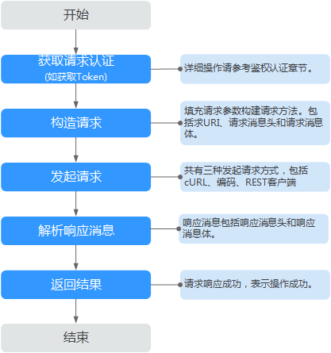

# 快速入门<a name="css_03_0062"></a>

本节通过调用云搜索服务的API创建CSS服务集群，CSS的接口调用流程如[图1](#zh-cn_topic_0171174235_fig4812113917173)所示。

**图 1**  接口调用流程<a name="zh-cn_topic_0171174235_fig4812113917173"></a>  


> **说明：** 
>通过IAM服务获取到的Token有效期为24小时，需要使用同一个Token鉴权时，可以先将Token缓存，避免频繁调用。

## 涉及API<a name="zh-cn_topic_0171174235_zh-cn_topic_0111418639_section101152312311"></a>

当您使用Token认证方式完成认证鉴权时，需要获取用户Token并在调用接口时增加“X-Auth-Token”到业务接口请求消息头中。

-   IAM获取token的API
-   CSS创建集群的API

## 具体步骤<a name="zh-cn_topic_0171174235_zh-cn_topic_0111418639_section84735913247"></a>

1.  <a name="zh-cn_topic_0171174235_li1265543762911"></a>发送“POST https://**IAM**_**的Endpoint**_/v3/auth/tokens”。

    -   Token认证，具体操作请参考[Token认证](认证鉴权.md#zh-cn_topic_0170917208_section34951335121613)。
    -   获取[IAM的Endpoint](https://developer.huaweicloud.com/endpoint?IAM)。
    -   [获取用户Token](https://support.huaweicloud.com/api-iam/iam_30_0001.html)

2.  在Request Header中增加“X-Auth-Token”和“Content-type ”。
    -   **Content-Type**：消息体的类型（格式），默认取值为“application/json“。
    -   **X-Auth-Token**：用户Token。用户Token也就是[步骤1](#zh-cn_topic_0171174235_li1265543762911)调用[获取用户Token](https://support.huaweicloud.com/api-iam/iam_30_0001.html)接口的响应值，该接口是唯一不需要认证的接口。

3.  在Request Body中传入参数如下：

    ```
    POST /v1.0/6204a5bd270343b5885144cf9c8c158d/clusters
    { 
        "cluster": { 
            "name": "ES-Test",
            "backupStrategy": {
                "period": "16:00 GMT+08:00",
                "prefix": "snapshot",
                "keepday": 7
            },
            "instanceNum": 3,
               "instance": { 
                   "flavorRef": "ess.spec-2u16g", 
                      "volume": { 
                             "volume_type": "COMMON", 
                             "size": 100
                      }, 
                      "nics": { 
                             "vpcId": "fccd753c-91c3-40e2-852f-5ddf76d1a1b2",
                             "netId": "af1c65ae-c494-4e24-acd8-81d6b355c9f1", 
                             "securityGroupId": "7e3fed21-1a44-4101-ab29-34e57124f614" 
                      }
               }
        } 
    }
    ```

    响应消息样例。

    ```
    {
      "cluster": {
        "id": "ef683016-871e-48bc-bf93-74a29d60d214",
        "name": "ES-Test"
      }
    }
    ```

    请求响应成功后，返回200 OK，表示集群创建成功。

    若请求失败，则会返回错误码及对应的错误信息说明，详细错误码信息请参考[状态码](状态码.md)。


