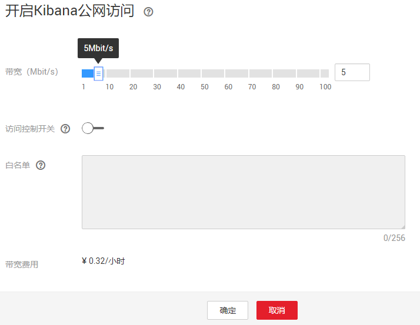

# Kibana公网访问

云搜索服务支持安全模式的集群通过公网访问云上Kibana服务。针对安全模式集群，云搜索服务支持配置Kibana开启公网访问，选择Kibana公网访问带宽，配置完成后，对应集群将会获得一个Kibana公网访问地址，通过这个地址可以在公网上面访问集群的Kibana。

对于安全模式集群来说，支持在创建的时候配置Kibana公网访问，同时也支持安全模式集群创建完之后，开启Kibana公网访问。

> **说明：** 
>如果在该特性上线之前购买的安全模式的集群，不支持此功能。

## 创建集群时配置Kibana公网访问

1.  登录云搜索服务管理控制台。
2.  在创建集群页面，开启“安全模式“。

    6.5.4及之后版本的集群支持开启“安全模式“。

3.  “高级配置“选择“自定义“后，开启Kibana公网访问，配置相关参数。

    **表 1**  Kibana公网访问参数说明

    
    <table><thead align="left"><tr id="row13115543918"><th class="cellrowborder" valign="top" width="23.830000000000002%" id="mcps1.2.3.1.1">
参数

    </th>
    <th class="cellrowborder" valign="top" width="76.17%" id="mcps1.2.3.1.2">
说明

    </th>
    </tr>
    </thead>
    <tbody><tr id="row15116743917"><td class="cellrowborder" valign="top" width="23.830000000000002%" headers="mcps1.2.3.1.1 ">
带宽

    </td>
    <td class="cellrowborder" valign="top" width="76.17%" headers="mcps1.2.3.1.2 ">
设置公网访问的带宽。

    
取值范围：1-100。

    
单位：Mbit/s。

    </td>
    </tr>
    <tr id="row1811610437113"><td class="cellrowborder" valign="top" width="23.830000000000002%" headers="mcps1.2.3.1.1 ">
访问控制开关

    </td>
    <td class="cellrowborder" valign="top" width="76.17%" headers="mcps1.2.3.1.2 ">
如果关闭访问控制开关，则允许任何IP通过公网IP访问集群Kibana。如果开启访问控制开关，则只允许白名单列表中的IP通过公网IP访问集群Kibana。

    </td>
    </tr>
    <tr id="row191163438120"><td class="cellrowborder" valign="top" width="23.830000000000002%" headers="mcps1.2.3.1.1 ">
白名单

    </td>
    <td class="cellrowborder" valign="top" width="76.17%" headers="mcps1.2.3.1.2 ">
设置允许访问的IP地址或网段，中间用英文逗号隔开。

    
建议开启白名单。

    </td>
    </tr>
    </tbody>
    </table>

    集群创建成功后，单击集群名称，进入集群基本信息页面，在“Kibana公网访问“页签，可以查看kibana公网访问地址。

## 已有集群开启Kibana公网访问

您可以对已经创建的安全模式集群的Kibana公网访问进行开启，关闭，修改，查看等操作。

1.  登录云搜索服务管理控制台。
2.  在集群管理页面，单击需要配置Kibana公网访问的集群名称，进入集群基本信息页面。
3.  选择“Kibana公网访问“页签，在**Kibana公网访问**右侧单击开关，打开Kibana公网访问功能。

    表示关闭Kibana公网访问功能，表示打开Kibana公网访问功能。

4.  在开启Kibana公网访问页面，配置相关参数。

    **图 1**  配置Kibana公网访问参数  
    

    **表 2**  Kibana公网访问参数说明

    
    <table><thead align="left"><tr id="css_01_0088_row13115543918"><th class="cellrowborder" valign="top" width="23.830000000000002%" id="mcps1.2.3.1.1">
参数

    </th>
    <th class="cellrowborder" valign="top" width="76.17%" id="mcps1.2.3.1.2">
说明

    </th>
    </tr>
    </thead>
    <tbody><tr id="css_01_0088_row15116743917"><td class="cellrowborder" valign="top" width="23.830000000000002%" headers="mcps1.2.3.1.1 ">
带宽

    </td>
    <td class="cellrowborder" valign="top" width="76.17%" headers="mcps1.2.3.1.2 ">
设置公网访问的带宽。

    
取值范围：1-100。

    
单位：Mbit/s。

    </td>
    </tr>
    <tr id="css_01_0088_row1811610437113"><td class="cellrowborder" valign="top" width="23.830000000000002%" headers="mcps1.2.3.1.1 ">
访问控制开关

    </td>
    <td class="cellrowborder" valign="top" width="76.17%" headers="mcps1.2.3.1.2 ">
如果关闭访问控制开关，则允许任何IP通过公网IP访问集群Kibana。如果开启访问控制开关，则只允许白名单列表中的IP通过公网IP访问集群Kibana。

    </td>
    </tr>
    <tr id="css_01_0088_row191163438120"><td class="cellrowborder" valign="top" width="23.830000000000002%" headers="mcps1.2.3.1.1 ">
白名单

    </td>
    <td class="cellrowborder" valign="top" width="76.17%" headers="mcps1.2.3.1.2 ">
设置允许访问的IP地址或网段，中间用英文逗号隔开。

    
建议开启白名单。

    </td>
    </tr>
    </tbody>
    </table>

5.  配置完成后，单击“确定”。

## 修改Kibana公网访问

对已经配置了Kibana公网访问的集群，云搜索服务支持修改带宽和访问控制功能。

-   修改带宽

    单击“带宽“参数右侧的“修改”，在“修改Kibana公网访问带宽”页面修改带宽大小，修改完成后，单击“确定“。

-   修改访问控制

    单击“访问控制开关“右侧的“修改”，在“修改Kibana公网访问控制”页面设置“访问控制开关“和访问“白名单“，修改完成后，单击“确定“。

## 通过公网IP访问Kibana

Kibana公网访问配置完成后，将会获得一个kibana公网访问地址，用户可以通过此IP访问集群的Kibana。

1.  登录云搜索服务管理控制台。
2.  在集群管理页面，单击需要配置Kibana公网访问的集群名称，进入集群基本信息页面。
3.  选择“Kibana公网访问“页签，获取kibana公网访问地址。
4.  通过该地址，就可以在公网上面访问云搜索服务集群的Kibana。

