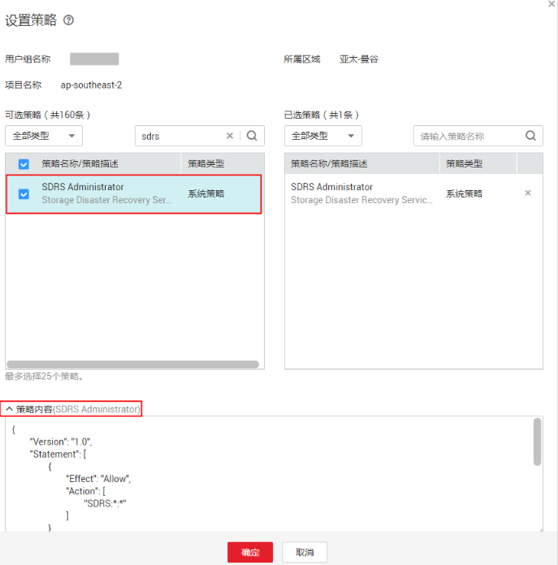

# RBAC策略语法<a name="css_01_0073"></a>

## 策略结构<a name="section412495316246"></a>

策略结构包括：策略版本号（Version）、策略授权语句（Statement）和策略依赖（Depends）。

**图 1**  策略结构<a name="fig926913534248"></a>  


## 策略语法<a name="section513575312247"></a>

如下以SDRS服务的“SDRSAdministraor”为例，说明RBAC策略语法。

**图 2**  RBAC策略设置<a name="fig1594135218570"></a>  


```
{ 
        "Version": "1.0", 
        "Statement": [ 
                { 
                        "Action": [ 
                                "SDRS:*:*" 
                        ], 
                        "Effect": "Allow" 
                } 
        ], 
        "Depends": [ 
                { 
                        "catalog": "BASE", 
                        "display_name": "Tenant Guest" 
                }, 
                { 
                        "catalog": "BASE", 
                        "display_name": "Server Administrator" 
                } 
        ] 
}
```

**表 1**  参数说明

<a name="table81377532243"></a>
<table><thead align="left"><tr id="row18270185312419"><th class="cellrowborder" colspan="2" valign="top" id="mcps1.2.5.1.1"><p id="p2027145316242"><a name="p2027145316242"></a><a name="p2027145316242"></a>参数</p>
</th>
<th class="cellrowborder" valign="top" id="mcps1.2.5.1.2"><p id="p1927195314246"><a name="p1927195314246"></a><a name="p1927195314246"></a>含义</p>
</th>
<th class="cellrowborder" valign="top" id="mcps1.2.5.1.3"><p id="p527115362418"><a name="p527115362418"></a><a name="p527115362418"></a>值</p>
</th>
</tr>
</thead>
<tbody><tr id="row13271165316249"><td class="cellrowborder" colspan="2" valign="top" headers="mcps1.2.5.1.1 "><p id="p10271125332414"><a name="p10271125332414"></a><a name="p10271125332414"></a>Version</p>
</td>
<td class="cellrowborder" valign="top" headers="mcps1.2.5.1.2 "><p id="p1271653192411"><a name="p1271653192411"></a><a name="p1271653192411"></a>策略的版本</p>
</td>
<td class="cellrowborder" valign="top" headers="mcps1.2.5.1.3 "><p id="p4271753132411"><a name="p4271753132411"></a><a name="p4271753132411"></a>固定为“1.0”</p>
</td>
</tr>
<tr id="row1627165313241"><td class="cellrowborder" rowspan="2" valign="top" width="17.17171717171717%" headers="mcps1.2.5.1.1 "><p id="p1527145352417"><a name="p1527145352417"></a><a name="p1527145352417"></a>Statement</p>
</td>
<td class="cellrowborder" valign="top" width="17.17171717171717%" headers="mcps1.2.5.1.1 "><p id="p5271195352418"><a name="p5271195352418"></a><a name="p5271195352418"></a>Action</p>
</td>
<td class="cellrowborder" valign="top" width="28.28282828282828%" headers="mcps1.2.5.1.2 "><p id="p727117536240"><a name="p727117536240"></a><a name="p727117536240"></a>定义对SDRS的具体操作。</p>
</td>
<td class="cellrowborder" valign="top" width="37.37373737373737%" headers="mcps1.2.5.1.3 "><p id="p927112536243"><a name="p927112536243"></a><a name="p927112536243"></a>格式为：服务名:资源类型:操作</p>
<p id="p5271135312246"><a name="p5271135312246"></a><a name="p5271135312246"></a>"SDRS:*:*"，表示对SDRS的所有操作，其中SDRS为服务名称；“*”为通配符，表示对所有的资源类型可以执行所有操作。</p>
</td>
</tr>
<tr id="row122717533243"><td class="cellrowborder" valign="top" headers="mcps1.2.5.1.1 "><p id="p1827175316245"><a name="p1827175316245"></a><a name="p1827175316245"></a>Effect</p>
</td>
<td class="cellrowborder" valign="top" headers="mcps1.2.5.1.1 "><p id="p227165322418"><a name="p227165322418"></a><a name="p227165322418"></a>定义Action中所包含的具体操作是否允许执行。</p>
</td>
<td class="cellrowborder" valign="top" headers="mcps1.2.5.1.2 "><a name="ul427112532243"></a><a name="ul427112532243"></a><ul id="ul427112532243"><li>Allow：允许执行。</li><li>Deny：不允许执行。</li></ul>
</td>
</tr>
<tr id="row1927110533243"><td class="cellrowborder" rowspan="2" valign="top" width="17.17171717171717%" headers="mcps1.2.5.1.1 "><p id="p15271125352418"><a name="p15271125352418"></a><a name="p15271125352418"></a>Depends</p>
</td>
<td class="cellrowborder" valign="top" width="17.17171717171717%" headers="mcps1.2.5.1.1 "><p id="p42717537242"><a name="p42717537242"></a><a name="p42717537242"></a>catalog</p>
</td>
<td class="cellrowborder" valign="top" width="28.28282828282828%" headers="mcps1.2.5.1.2 "><p id="p162724536240"><a name="p162724536240"></a><a name="p162724536240"></a>依赖的其他策略的所属目录。</p>
</td>
<td class="cellrowborder" valign="top" width="37.37373737373737%" headers="mcps1.2.5.1.3 "><p id="p172724538241"><a name="p172724538241"></a><a name="p172724538241"></a>服务名称</p>
<p id="p8272053182414"><a name="p8272053182414"></a><a name="p8272053182414"></a>例如：BASE</p>
</td>
</tr>
<tr id="row18272155322412"><td class="cellrowborder" valign="top" headers="mcps1.2.5.1.1 "><p id="p527225319247"><a name="p527225319247"></a><a name="p527225319247"></a>display_name</p>
</td>
<td class="cellrowborder" valign="top" headers="mcps1.2.5.1.1 "><p id="p727217538249"><a name="p727217538249"></a><a name="p727217538249"></a>依赖的其他权限的名称。</p>
</td>
<td class="cellrowborder" valign="top" headers="mcps1.2.5.1.2 "><p id="p1627214539247"><a name="p1627214539247"></a><a name="p1627214539247"></a>权限名称</p>
<p id="p14272115362419"><a name="p14272115362419"></a><a name="p14272115362419"></a>例如：Tenant Guest，Server Administrator</p>
</td>
</tr>
</tbody>
</table>

