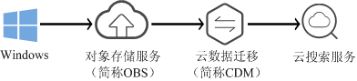

# 使用CDM从OBS导入数据到Elasticsearch<a name="css_01_0046"></a>

云搜索服务支持通过CDM的向导式界面，将存储在对象存储服务（简称OBS）中的数据导入到Elasticsearch中。数据文件支持JSON、CSV等格式。

数据传输流程如[图1](#fig1214102620618)所示。

**图 1**  使用CDM从OBS导入数据到Elasticsearch时的数据传输流程<a name="fig1214102620618"></a>  


## 操作步骤<a name="section189761043105118"></a>

1.  登录OBS管理控制台。
2.  创建待存储数据的OBS桶。

    具体操作请参见《对象存储服务控制台指南》中的[创建桶](https://support.huaweicloud.com/usermanual-obs/obs_03_0306.html)。

3.  将数据文件上传到OBS桶中。

    具体操作请参见《对象存储服务控制台指南》中的[上传文件](https://support.huaweicloud.com/usermanual-obs/obs_03_0307.html)。

    例如：将如下数据保存为json格式的文件，上传到创建的OBS桶中。

    ```
    {"productName":"2017秋装新款文艺衬衫女装","size":"L"}
    {"productName":"2017秋装新款文艺衬衫女装","size":"M"}
    {"productName":"2017秋装新款文艺衬衫女装","size":"S"}
    {"productName":"2018春装新款牛仔裤女装","size":"M"}
    {"productName":"2018春装新款牛仔裤女装","size":"S"}
    {"productName":"2017春装新款休闲裤女装","size":"L"}
    {"productName":"2017春装新款休闲裤女装","size":"S"}
    ```

4.  登录云搜索服务管理控制台。
5.  在左侧导航栏中，选择“集群管理“，进入集群列表页面。
6.  在集群列表页面中，单击待导入数据的集群“操作“列的“Kibana“。
7.  在Kibana的左侧导航中选择“Dev Tools”，单击“Get to work“，进入Console界面。
8.  在Console界面，执行命令创建待存储数据的索引，并指定自定义映射来定义数据类型。

    如果待导入数据的集群已存在可用的索引，则不需要再创建索引；如果待导入数据的集群不存在可用的索引，则需要参考如下示例创建索引。

    例如：在Console界面，执行如下命令，创建索引“demo“，并指定自定义映射来定义数据类型。

    ```
    PUT /demo
    {
      "settings": {
        "number_of_shards": 1
      },
      "mappings": {
        "products": {
          "properties": {
            "productName": {
              "type": "text",
              "analyzer": "ik_smart"
            },
            "size": {
              "type": "keyword"
            }
          }
        }
      }
    }
    ```

    执行成功后显示如下：

    ```
    {
      "acknowledged" : true,
      "shards_acknowledged" : true,
      "index" : "demo"
    }
    ```

9.  登录CDM管理控制台。
10. 购买云数据迁移集群。

    具体操作请参见《云数据迁移用户指南》中的[创建集群](https://support.huaweicloud.com/usermanual-cdm/cdm_01_0018.html)。

11. 新建CDM和云搜索服务的连接。

    具体操作请参见《云数据迁移用户指南》中的[新建连接](https://support.huaweicloud.com/usermanual-cdm/cdm_01_0023.html)。

12. 新建CDM和OBS的连接。

    具体操作请参见《云数据迁移用户指南》中的[新建连接](https://support.huaweicloud.com/usermanual-cdm/cdm_01_0023.html)。

13. 在已购买的云数据迁移集群上新建作业，将OBS桶中的数据迁移到云搜索服务的待导入数据的集群中。

    具体操作请参见《云数据迁移用户指南》中的[表/文件迁移](https://support.huaweicloud.com/usermanual-cdm/cdm_01_0033.html)。

14. 在已打开的Kibana的Console界面，通过搜索获取已导入的数据。

    在Kibana控制台，执行如下命令，搜索数据。查看搜索结果，如果数据与导入数据一致，表示数据文件的数据已导入成功。

    ```
    GET demo/_search
    ```

    执行成功后显示如下：

    ```
    {
      "took": 18,
      "timed_out": false,
      "_shards": {
        "total": 1,
        "successful": 1,
        "skipped": 0,
        "failed": 0
      },
      "hits": {
        "total": 7,
        "max_score": 1,
        "hits": [
          {
            "_index": "demo",
            "_type": "products",
            "_id": "g6UepnEBuvdFwWkRmn4V",
            "_score": 1,
            "_source": {
              "size": """"size":"L"}""",
              "productName": """{"productName":"2017秋装新款文艺衬衫女装""""
            }
          },
          {
            "_index": "demo",
            "_type": "products",
            "_id": "hKUepnEBuvdFwWkRmn4V",
            "_score": 1,
            "_source": {
              "size": """"size":"M"}""",
              "productName": """{"productName":"2017秋装新款文艺衬衫女装""""
            }
          },
          {
            "_index": "demo",
            "_type": "products",
            "_id": "haUepnEBuvdFwWkRmn4V",
            "_score": 1,
            "_source": {
              "size": """"size":"S"}""",
              "productName": """{"productName":"2017秋装新款文艺衬衫女装""""
            }
          },
          {
            "_index": "demo",
            "_type": "products",
            "_id": "hqUepnEBuvdFwWkRmn4V",
            "_score": 1,
            "_source": {
              "size": """"size":"M"}""",
              "productName": """{"productName":"2018春装新款牛仔裤女装""""
            }
          },
          {
            "_index": "demo",
            "_type": "products",
            "_id": "h6UepnEBuvdFwWkRmn4V",
            "_score": 1,
            "_source": {
              "size": """"size":"S"}""",
              "productName": """{"productName":"2018春装新款牛仔裤女装""""
            }
          },
          {
            "_index": "demo",
            "_type": "products",
            "_id": "iKUepnEBuvdFwWkRmn4V",
            "_score": 1,
            "_source": {
              "size": """"size":"L"}""",
              "productName": """{"productName":"2017春装新款休闲裤女装""""
            }
          },
          {
            "_index": "demo",
            "_type": "products",
            "_id": "iaUepnEBuvdFwWkRmn4V",
            "_score": 1,
            "_source": {
              "size": """"size":"S"}""",
              "productName": """{"productName":"2017春装新款休闲裤女装""""
            }
          }
        ]
      }
    }
    ```

    > **说明：**   
    >demo为创建的索引名称，需根据实际情况填写。  


