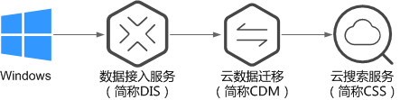

# 使用DIS导入本地数据到Elasticsearch<a name="css_01_0047"></a>

通过DIS可以将本地windows系统上的日志数据上传到DIS队列中，然后通过CDM可以将DIS队列中的数据迁移到云搜索服务的Elasticsearch中，从而方便用户使用Elasticsearch搜索引擎高效管理和获取日志。数据文件支持JSON、CSV等格式。

数据传输流程如[图1](#fig1573714916810)所示。

**图 1**  使用DIS导入本地数据到Elasticsearch时的数据传输流程<a name="fig1573714916810"></a>  


## 操作步骤<a name="section1666893310419"></a>

1.  登录DIS管理控制台。
2.  购买接入通道。

    具体操作请参见《数据接入服务用户指南》中的[开通DIS通道](https://support.huaweicloud.com/usermanual-dis/dis_01_0601.html)。

3.  安装并配置DIS Agent。

    具体操作请参见《数据接入服务用户指南》中的[安装DIS Agent](https://support.huaweicloud.com/usermanual-dis/dis_01_0023.html)和[配置DIS Agent](https://support.huaweicloud.com/usermanual-dis/dis_01_0024.html)。

4.  启动DIS Agent，将采集的本地数据上传到DIS队列中。

    具体操作请参见《数据接入服务用户指南》中的[启动DIS Agent](https://support.huaweicloud.com/usermanual-dis/dis_01_0025.html)。

    例如：将如下数据通过DIS Agent上传到DIS队列中。

    ```
    {"logName":"aaa","date":"bbb"}
    {"logName":"ccc","date":"ddd"}
    {"logName":"eee","date":"fff"}
    {"logName":"ggg","date":"hhh"}
    {"logName":"mmm","date":"nnn"}
    ```

5.  登录云搜索服务管理控制台。
6.  在左侧导航栏中，选择“集群管理“，进入集群列表页面。
7.  在集群列表页面中，单击待导入数据的集群“操作“列的“Kibana“。
8.  在Kibana的左侧导航中选择“Dev Tools”，单击“Get to work“，进入Console界面。
9.  在Console界面，执行命令创建待存储数据的索引，并指定自定义映射来定义数据类型。

    如果待导入数据的集群已存在可用的索引，则不需要再创建索引；如果待导入数据的集群不存在可用的索引，则需要参考如下示例创建索引。

    例如：在Console界面，执行如下命令，创建索引“apache“，并指定自定义映射来定义数据类型。

    ```
    PUT /apache
    {
        "settings": {
            "number_of_shards": 1
        },
        "mappings": {
            "logs": {
                "properties": {
                    "logName": {
                        "type": "text",
                        "analyzer": "ik_smart"
                    },
                    "date": {
                        "type": "keyword"
                    }
                }
            }
        }
    }
    ```

    执行成功后显示如下：

    ```
    {
      "acknowledged" : true,
      "shards_acknowledged" : true,
      "index" : "apache"
    }
    ```

10. 登录CDM管理控制台。
11. 购买云数据迁移集群。

    具体操作请参见《云数据迁移用户指南》中的[创建集群](https://support.huaweicloud.com/usermanual-cdm/cdm_01_0018.html)。

12. 新建CDM和云搜索服务的连接。

    具体操作请参见《云数据迁移用户指南》中的[新建连接](https://support.huaweicloud.com/usermanual-cdm/cdm_01_0023.html)。

13. 新建CDM和DIS的连接。

    具体操作请参见《云数据迁移用户指南》中的[新建连接](https://support.huaweicloud.com/usermanual-cdm/cdm_01_0023.html)。

14. 在已购买的云数据迁移集群上新建作业，将DIS队列中的数据迁移到云搜索服务的待导入数据的集群中。

    具体操作请参见《云数据迁移用户指南》中的[表/文件迁移](https://support.huaweicloud.com/usermanual-cdm/cdm_01_0033.html)。

15. 在已打开的Kibana的Console界面，通过搜索获取已导入的数据。

    在Kibana控制台，输入如下命令，搜索数据。查看搜索结果，如果数据与导入数据一致，表示数据文件的数据已导入成功。

    ```
    GET apache/_search
    ```

    执行成功后显示如下：

    ```
    {
      "took": 81,
      "timed_out": false,
      "_shards": {
        "total": 1,
        "successful": 1,
        "skipped": 0,
        "failed": 0
      },
      "hits": {
        "total": 5,
        "max_score": 1,
        "hits": [
          {
            "_index": "apache",
            "_type": "logs",
            "_id": "txfbqnEBPuwwWJWL-qvP",
            "_score": 1,
            "_source": {
              "date": """{"logName":"aaa"""",
              "logName": """"date":"bbb"}"""
            }
          },
          {
            "_index": "apache",
            "_type": "logs",
            "_id": "uBfbqnEBPuwwWJWL-qvP",
            "_score": 1,
            "_source": {
              "date": """{"logName":"ccc"""",
              "logName": """"date":"ddd"}"""
            }
          },
          {
            "_index": "apache",
            "_type": "logs",
            "_id": "uRfbqnEBPuwwWJWL-qvP",
            "_score": 1,
            "_source": {
              "date": """{"logName":"eee"""",
              "logName": """"date":"fff"}"""
            }
          },
          {
            "_index": "apache",
            "_type": "logs",
            "_id": "uhfbqnEBPuwwWJWL-qvP",
            "_score": 1,
            "_source": {
              "date": """{"logName":"ggg"""",
              "logName": """"date":"hhh"}"""
            }
          },
          {
            "_index": "apache",
            "_type": "logs",
            "_id": "uxfbqnEBPuwwWJWL-qvP",
            "_score": 1,
            "_source": {
              "date": """{"logName":"mmm"""",
              "logName": """"date":"nnn"}"""
            }
          }
        ]
      }
    }
    ```

    > **说明：**   
    >apache为创建的索引名称，需根据实际情况填写。  


