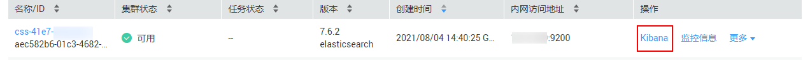
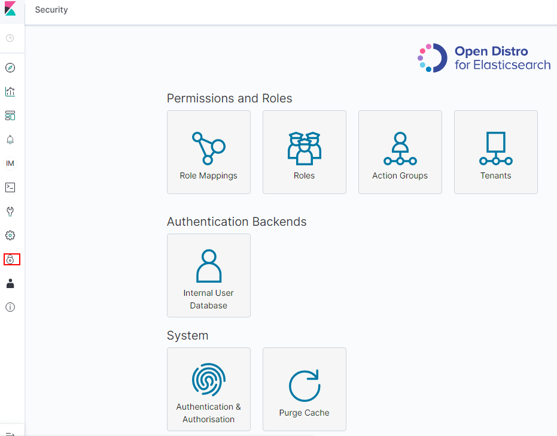
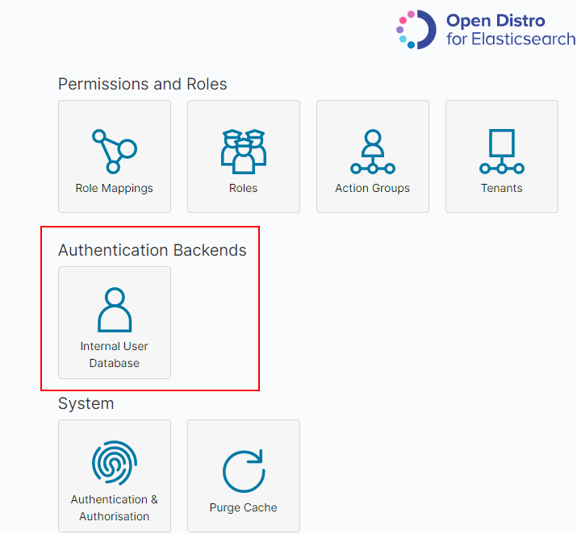
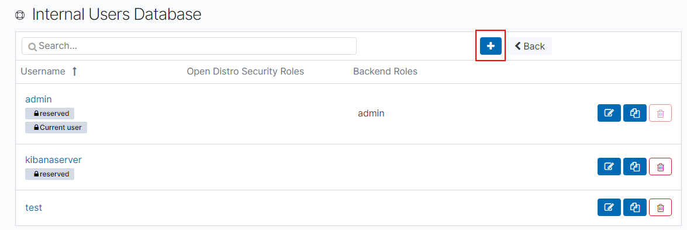
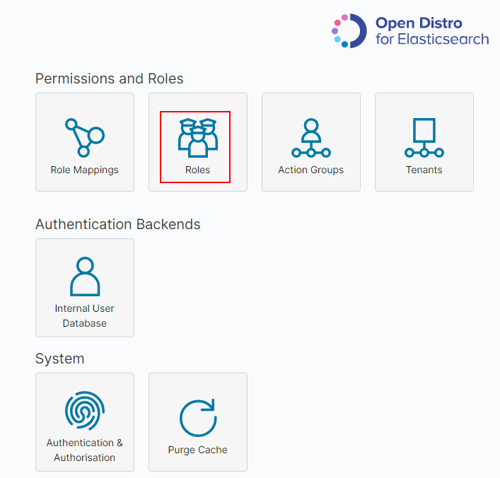
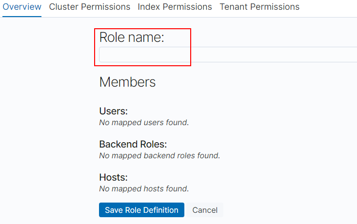
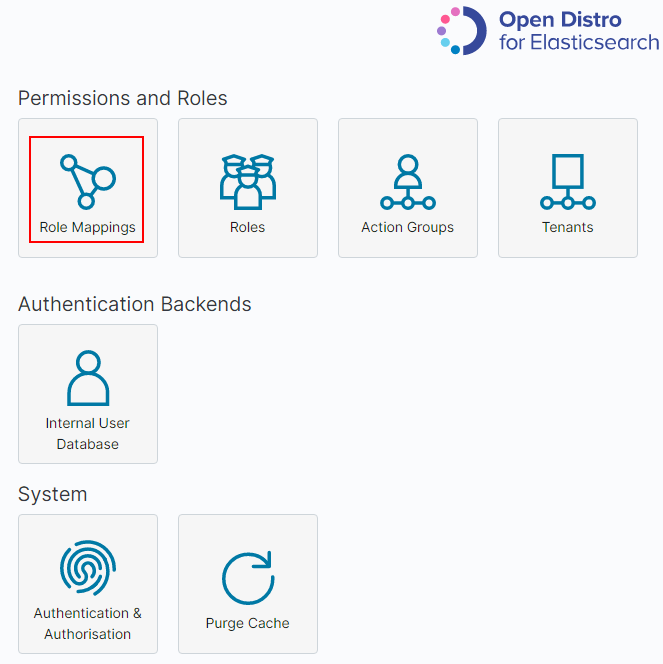
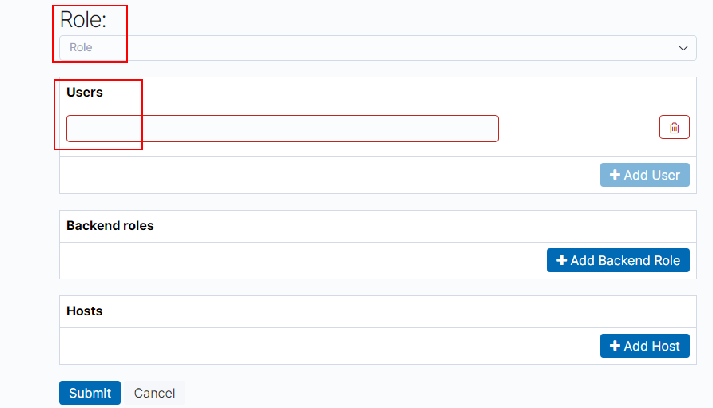

# 使用Kibana创建用户并授权

## 前提条件

集群必须开启安全模式。

## 操作步骤

> **说明：** 
>不同的版本之间Kibana界面有差异，本章节以7.6.2版本集群为例。

1.  登录云搜索服务控制台。
2.  选择对应集群后面的Kibana。

    **图 1**  登录Kibana（1）  
    

3.  单击操作列的Kibana，进入登录界面。

    **图 2**  登录Kibana（2）  
    

    -   用户名：admin。
    -   密码：创建集群时设置的密码。

4.  登录成功后，在Kibana操作界面，选择“Security“，进入对应页面。

    **图 3**  进入Security界面  
    

5.  创建用户。
    1.  选择“Authentication Backends“\>“Internal Users Database“，进入创建用户页面。

        **图 4**  添加用户（1）  
        

    2.  在“Internal Users Database“页面，选择，进入添加用户信息页面。

        **图 5**  添加用户（2）  
        

    3.  在创建用户页面，输入“Username“和“Password“，单击“Submit“。

        创建成功后，可以在列表中看到新创建的用户。

6.  用户创建成功后，需要创建角色类型，设置权限。
    1.  在“Security“中选择“Roles“，进入Open Distro Security Roles页面。

        **图 6**  添加角色  
        

    2.  在Open Distro Security Roles页面，单击添加角色权限。
        1.  在Overview页面设置角色名。

            **图 7**  添加角色名称  
            

        2.  在“Cluster Permissions“页面设置CSS集群权限。此处无需设置。
        3.  在“Index Permissions“页面设置索引权限。

            Index patterns：配置为需要设置权限的索引名称，例如，索引模板名称为my\_store。

            > **说明：** 
            >建议索引名称和创建的用户名不要相同。

            Permissions: Action Groups：根据需要开通的权限设置。例如，只读权限选择Search。

        4.  “Tenant Permissions“页面无需设置。

            设置完成后，即可看到设置的角色。

7.  给用户配置角色。
    1.  在“Security“中选择“Role Mappings“，进入Role Mappings页面。

        **图 8**  角色映射  
        

    2.  在Role Mappings页面，单击，添加用户和角色映射。

        **图 9**  用户和角色映射  
        

    3.  添加完成后，单击“Submit“。

8.  配置完成后，可以在Kibana中进行验证是否生效。

