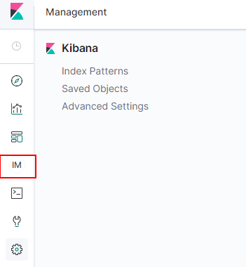
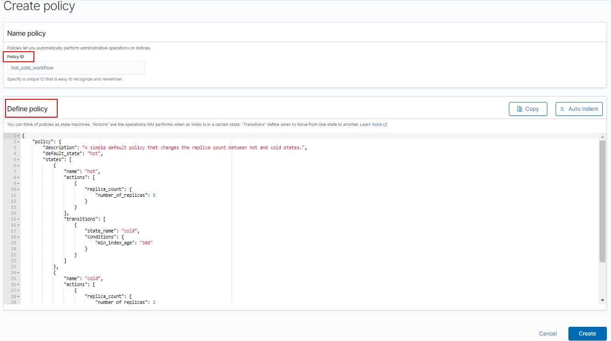
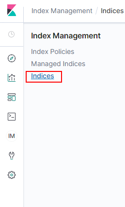
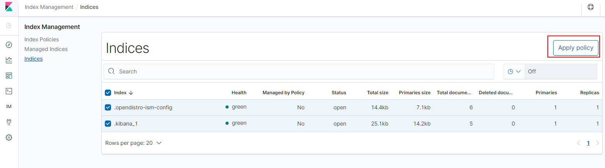
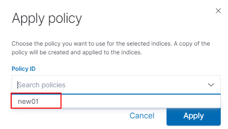

# 创建及管理索引<a name="css_01_0093"></a>

云搜索服务7.6.2版本的集群支持索引状态管理。索引状态管理（ISM）是一个插件，通过该插件，您可以根据索引使用期限，索引大小或文档数的变化触发这些定期的管理操作，从而使它们自动化。使用ISM插件时，您可以根据需要定义自动处理索引滚动或删除的策略。

## 创建索引策略<a name="section779154094817"></a>

1.  登录Kibana，在左侧选择IM，进入索引管理页面 。

    **图 1**  选择IM<a name="fig1447493074011"></a>  
    

2.  单击**Create policy**，创建索引策略。
3.  <a name="li66234455115"></a>在**Policy ID**部分输入策略ID，**Define policy**部分输入您的策略。

    **图 2**  配置策略<a name="fig11427149204015"></a>  
    

4.  单击**Create**。

    创建策略后，下一步将此策略附加到一个或多个索引。您还可以将policy\_id在索引模板中包含，因此当创建与索引模板模式匹配的索引时，该索引将附加有策略。

    创建索引模板可参考[索引模板](https://opendistro.github.io/for-elasticsearch-docs/docs/elasticsearch/index-templates/#create-template)。

    ```
    PUT _template/<template_name> 
    {
        "index_patterns": [
            "index_name-*"
        ],
        "settings": {
            "opendistro.index_state_management.policy_id": "policy_id"
        }
    }
    ```

    -   <template\_name\>：需要替换为创建的索引模板名。
    -   policy\_id：需要替换为[3](#li66234455115)创建的Policy ID。


## 将策略附加到索引<a name="section11451321182815"></a>

1.  选择**Indices**。

    **图 3**  选择Indices<a name="fig1194814714117"></a>  
    

2.  在**Indices**列表中选择您要附加策略的一个或多个索引。
3.  单击右上角的**Apply policy**，添加应用策略。

    **图 4**  添加引用策略<a name="fig02609262411"></a>  
    

4.  从**Policy ID**菜单中，选择您创建的策略。

    **图 5**  选择<a name="fig2537324154211"></a>  
    

5.  单击**Apply**。

    将策略附加到索引后，ISM会默认创建每5分钟运行一次的作业，以执行策略操作，检查条件并将索引转换为不同的状态。


## 管理索引<a name="section87941257192"></a>

1.  选择**Managed Indices**。
2.  如果您要更改策略，可以选择**Change policy**，详情请参考**变更策略**。
3.  如果您要删除策略，请选择您的策略，然后选择**Remove policy**。
4.  如果您要重试策略，请选择您的策略，然后选择**Retry policy**。

具体使用可参考[索引管理官方介绍](https://opendistro.github.io/for-elasticsearch-docs/docs/im/ism/)。

