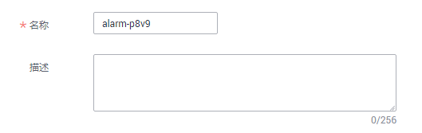
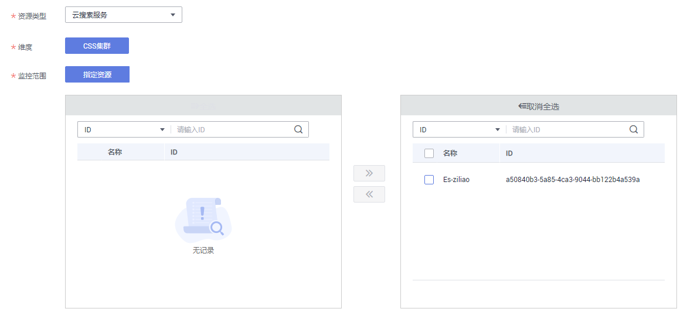

# 创建告警规则

通过在云监控服务管理控制台创建集群指标的告警规则，当监控指标达到用户设置的告警规则触发告警时，用户可以及时了解集群的异常状况并采取措施，以免造成业务损失。

## 操作步骤

1.  登录管理控制台。
2.  选择“服务列表\>管理与部署 \> 云监控服务“。
3.  在左侧导航树栏，选择“告警 \> 告警规则“。
4.  在“告警规则“界面，单击“创建告警规则“。
5.  在“创建告警规则“对话框中，根据界面提示配置参数。

    云监控服务支持对某个特定的监控指标设置自定义告警规则，同时也支持使用告警模板为多个实例或者云服务批量创建告警规则。这里以使用告警模板创建云搜索服务的集群的告警规则为例，介绍如何创建告警规则。

    1.  配置告警名称和描述信息。

        **图 1**  配置规则信息  
        

        **表 1**  参数说明

        
        <table><thead align="left"><tr id="row84469260443"><th class="cellrowborder" valign="top" width="17.691769176917692%" id="mcps1.2.4.1.1">
参数

        </th>
        <th class="cellrowborder" valign="top" width="38.88388838883888%" id="mcps1.2.4.1.2">
说明

        </th>
        <th class="cellrowborder" valign="top" width="43.42434243424342%" id="mcps1.2.4.1.3">
示例

        </th>
        </tr>
        </thead>
        <tbody><tr id="row1544712269444"><td class="cellrowborder" valign="top" width="17.691769176917692%" headers="mcps1.2.4.1.1 ">
名称

        </td>
        <td class="cellrowborder" valign="top" width="38.88388838883888%" headers="mcps1.2.4.1.2 ">
系统会随机产生一个名称，用户也可以进行修改。

        </td>
        <td class="cellrowborder" valign="top" width="43.42434243424342%" headers="mcps1.2.4.1.3 ">
alarm-p8v9

        </td>
        </tr>
        <tr id="row204471826184418"><td class="cellrowborder" valign="top" width="17.691769176917692%" headers="mcps1.2.4.1.1 ">
描述

        </td>
        <td class="cellrowborder" valign="top" width="38.88388838883888%" headers="mcps1.2.4.1.2 ">
告警规则描述（此参数非必填项）。

        </td>
        <td class="cellrowborder" valign="top" width="43.42434243424342%" headers="mcps1.2.4.1.3 ">
-

        </td>
        </tr>
        </tbody>
        </table>

    2.  选择监控对象，配置告警内容参数。

        **图 2**  配置告警内容  
        

        **表 2**  配置告警内容

        
        <table><thead align="left"><tr id="row1424123114814"><th class="cellrowborder" valign="top" width="20.6020602060206%" id="mcps1.2.4.1.1">
参数

        </th>
        <th class="cellrowborder" valign="top" width="55.635563556355635%" id="mcps1.2.4.1.2">
说明

        </th>
        <th class="cellrowborder" valign="top" width="23.762376237623766%" id="mcps1.2.4.1.3">
示例

        </th>
        </tr>
        </thead>
        <tbody><tr id="row2425123120487"><td class="cellrowborder" valign="top" width="20.6020602060206%" headers="mcps1.2.4.1.1 ">
资源类型

        </td>
        <td class="cellrowborder" valign="top" width="55.635563556355635%" headers="mcps1.2.4.1.2 ">
配置告警规则监控的服务名称。

        </td>
        <td class="cellrowborder" valign="top" width="23.762376237623766%" headers="mcps1.2.4.1.3 ">
云搜索服务

        </td>
        </tr>
        <tr id="row74251316481"><td class="cellrowborder" valign="top" width="20.6020602060206%" headers="mcps1.2.4.1.1 ">
维度

        </td>
        <td class="cellrowborder" valign="top" width="55.635563556355635%" headers="mcps1.2.4.1.2 ">
用于指定告警规则对应指标的维度名称。目前支持的维度包括：

        <ul id="ul1576415021920"><li>CSS集群：以集群维度指定告警规则。</li><li>CSS集群 - 云服务节点：以集群中的某个节点维度指定告警规则。</li></ul>
        </td>
        <td class="cellrowborder" valign="top" width="23.762376237623766%" headers="mcps1.2.4.1.3 ">
CSS集群

        </td>
        </tr>
        <tr id="row6426113194818"><td class="cellrowborder" valign="top" width="20.6020602060206%" headers="mcps1.2.4.1.1 ">
监控范围

        </td>
        <td class="cellrowborder" valign="top" width="55.635563556355635%" headers="mcps1.2.4.1.2 ">
告警规则适用的资源范围，可选择资源分组或指定资源。

        
说明：

        <ul id="ul65011239162910"><li>当选择资源分组时，该分组下任何资源满足告警策略时，都会触发告警通知。</li><li>选择指定资源时，勾选具体的监控对象，单击将监控对象同步到右侧对话框。</li></ul>
        </td>
        <td class="cellrowborder" valign="top" width="23.762376237623766%" headers="mcps1.2.4.1.3 ">
指定资源

        </td>
        </tr>
        </tbody>
        </table>

    3.  配置“选择类型“、“模板“和“发送通知“等参数。

        **表 3**  参数说明

        
        <table><thead align="left"><tr id="row108623458218"><th class="cellrowborder" valign="top" width="18.291829182918292%" id="mcps1.2.4.1.1">
参数

        </th>
        <th class="cellrowborder" valign="top" width="49.974997499749975%" id="mcps1.2.4.1.2">
说明

        </th>
        <th class="cellrowborder" valign="top" width="31.733173317331737%" id="mcps1.2.4.1.3">
示例

        </th>
        </tr>
        </thead>
        <tbody><tr id="row1486413457214"><td class="cellrowborder" valign="top" width="18.291829182918292%" headers="mcps1.2.4.1.1 ">
选择类型

        </td>
        <td class="cellrowborder" valign="top" width="49.974997499749975%" headers="mcps1.2.4.1.2 ">
根据需要可选择从模板导入或自定义创建。

        
当监控范围为指定资源时可选择从模板导入。如果选择自定义创建，详细请参考<a href="https://support.huaweicloud.com/usermanual-ces/zh-cn_topic_0084572213.html" target="_blank" rel="noopener noreferrer">云监控服务创建告警规则和通知</a>。

        </td>
        <td class="cellrowborder" valign="top" width="31.733173317331737%" headers="mcps1.2.4.1.3 ">
自定义创建

        </td>
        </tr>
        <tr id="row886510451211"><td class="cellrowborder" valign="top" width="18.291829182918292%" headers="mcps1.2.4.1.1 ">
模板

        </td>
        <td class="cellrowborder" valign="top" width="49.974997499749975%" headers="mcps1.2.4.1.2 ">
选择需要导入的模板。

        </td>
        <td class="cellrowborder" valign="top" width="31.733173317331737%" headers="mcps1.2.4.1.3 ">
-

        </td>
        </tr>
        <tr id="row13865144510214"><td class="cellrowborder" valign="top" width="18.291829182918292%" headers="mcps1.2.4.1.1 ">
发送通知

        </td>
        <td class="cellrowborder" valign="top" width="49.974997499749975%" headers="mcps1.2.4.1.2 ">
如果已开启发送通知功能，则需要配置生效时间、通知对象和触发条件。

        </td>
        <td class="cellrowborder" valign="top" width="31.733173317331737%" headers="mcps1.2.4.1.3 ">
-

        </td>
        </tr>
        </tbody>
        </table>

    4.  配置完成后，单击“立即创建”，完成告警规则的创建。

        创建成功后，告警规则列表中将会显示已创建的告警规则。

