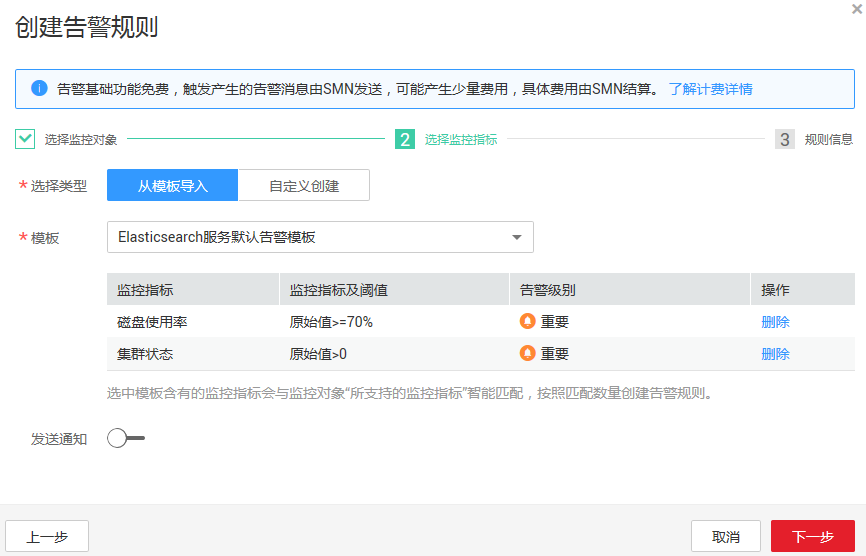
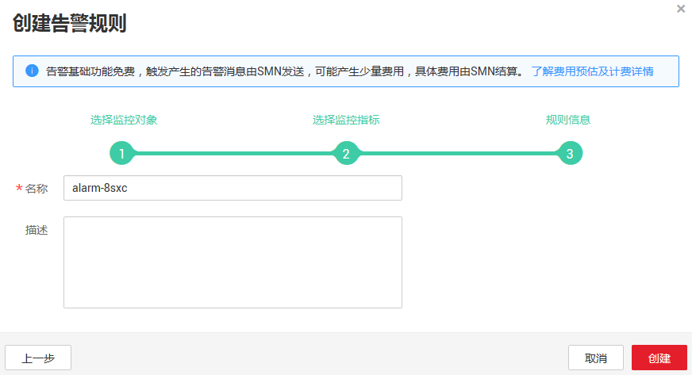

# 创建告警规则

通过在云监控服务管理控制台创建集群指标的告警规则，当监控指标达到用户设置的告警规则触发告警时，用户可以及时了解集群的异常状况并采取措施，以免造成业务损失。

## 操作步骤

1.  登录管理控制台。
2.  选择“管理与部署 \> 云监控“。
3.  在左侧导航树栏，选择“告警 \> 告警规则“。
4.  在“告警规则“界面，单击“创建告警规则“。
5.  在“创建告警规则“对话框中，根据界面提示配置参数。

    云监控服务支持对某个特定的监控指标设置自定义告警规则，同时也支持使用告警模板为多个实例或者云服务批量创建告警规则。这里以使用告警模板创建云搜索服务的集群的告警规则为例，介绍如何创建告警规则。

    1.  配置“资源类型“、“维度“和“监控对象“参数。

        **图 1**  选择监控对象  
        

    2.  单击“下一步“。
    3.  配置“选择类型“、“模板“和“发送通知“等参数。

        > **说明：**   
        >如果已开启发送通知功能，则需要设置“主题名称“和“触发场景“参数。反之，不需要设置“主题名称“和“触发场景“参数。  

        **图 2**  选择监控指标  
        

    4.  单击“下一步“。
    5.  配置“名称“参数。

        **图 3**  设置规则信息  
        

    6.  单击“创建“。

    创建成功后，告警规则列表中将会显示已创建的告警规则。

