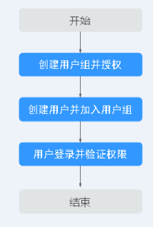

# 创建用户并授权使用CSS

本章节介绍创建CSS用户操作，将CSS服务的策略授予用户组，并将用户添加至用户组中（一个用户组下面的用户具有相同的权限），从而使用户拥有对应的CSS权限，操作流程如[图1 给用户授权CSS权限流程](#fig342064620244)所示。

CSS具有两种类型用户权限（CSS管理员权限和只读权限），在权限规划的时候请规划这两种类型的用户组。

## 前提条件

给用户组授权之前，请您了解用户组可以添加的CSS系统策略，请参见[权限管理](https://support.huaweicloud.com/productdesc-css/css_04_0014.html)__。若您需要对除CSS之外的其它服务授权，IAM支持服务的所有策略请参见[权限策略](https://support.huaweicloud.com/usermanual-permissions/iam_01_0001.html)。

## 示例流程

**图 1**  给用户授权CSS权限流程  

1.  [创建用户组并授权](https://support.huaweicloud.com/usermanual-iam/iam_03_0001.html)

    在IAM控制台创建用户组，并授予云搜索服务权限。

2.  [创建用户并加入用户组](https://support.huaweicloud.com/usermanual-iam/iam_02_0001.html)

    在IAM控制台创建用户，并将其加入[1.创建用户组并授权](#li1157731913917)中创建的用户组。

3.  [用户登录](https://support.huaweicloud.com/usermanual-iam/iam_01_0552.html)并验证权限

    新创建的用户登录控制台，验证云搜索服务的权限。

