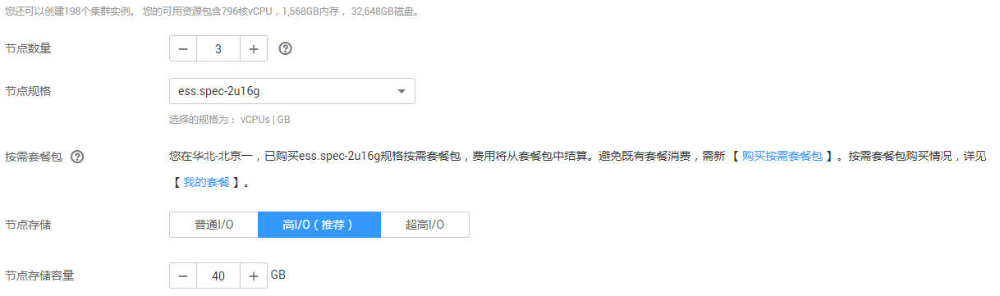

# 创建集群

在开始使用云搜索服务时，您必须创建一个集群。

## 背景信息

-   如果您要以折扣套餐计费方式使用集群，则需要提前购买折扣套餐，再创建与折扣套餐中区域、节点规格相同的集群。购买折扣套餐的具体操作步骤，请参见《云搜索服务购买指南》中的[折扣套餐](https://support.huaweicloud.com/pg-css/css_05_0003.html)章节。
-   如果您要以按需计费方式使用集群，则直接创建集群。

## 操作步骤

1.  登录云搜索服务管理控制台。
2.  在“总览“或者“集群管理“页面，单击“创建集群“，进入“创建集群”页面。
3.  选择“当前区域“和“可用区“。

    “当前区域“：集群工作区域在右侧下拉框中选择。目前工作区域仅支持“华北-北京一”、“华东-上海二”和“华南-广州”。

    “可用区“：一个AZ是一个或多个物理数据中心的集合，有独立的风火水电，AZ内逻辑上再将计算、网络、存储等资源划分成多个集群。一个Region中的多个AZ间通过高速光纤相连，以满足用户跨AZ构建高可用性系统的需求。选择集群工作区域下关联的可用区。

4.  指定集群基本信息，选择“集群版本“，并输入“集群名称“。

    -   “集群版本“：当前仅支持5.5.1和6.2.3。
    -   “集群名称“：自定义的集群名称，4～32个字符，只能包含数字、字母、中划线和下划线，且必须以字母开头。

    **图 1**  基本信息配置  
    

5.  指定集群的主机规格相关参数。

    **表 1**  参数说明

    
    <table><thead align="left"><tr id="row14509181918241"><th class="cellrowborder" valign="top" width="25%" id="mcps1.2.3.1.1">
参数

    </th>
    <th class="cellrowborder" valign="top" width="75%" id="mcps1.2.3.1.2">
说明

    </th>
    </tr>
    </thead>
    <tbody><tr id="row15509111982410"><td class="cellrowborder" valign="top" width="25%" headers="mcps1.2.3.1.1 ">
“节点数量”

    </td>
    <td class="cellrowborder" valign="top" width="75%" headers="mcps1.2.3.1.2 ">
集群中的节点个数。

    <ul id="ul55091419152414"><li>如果未启用Master节点和Client节点时，此参数指定的节点将被作为Master节点和Client节点，同时具备集群管理、存储数据、提供接入集群和分析数据的服务。此时，为保证集群中数据的稳定性，建议设置节点数量大于等于3个。</li><li>如果启用Master节点，且未启用Client节点，此参数指定的节点将用于存储数据并提供Client节点功能。</li><li>如果已启用Master节点和Client节点，此参数指定的节点将仅用于存储数据。</li></ul>
    </td>
    </tr>
    <tr id="row65090196243"><td class="cellrowborder" valign="top" width="25%" headers="mcps1.2.3.1.1 ">
“节点规格”

    </td>
    <td class="cellrowborder" valign="top" width="75%" headers="mcps1.2.3.1.2 ">
集群中的节点规格，当前支持5种规格：ess.spec-1u8g、ess.spec-2u16g、ess.spec-4u32g、ess.spec-8u64g、ess.spec-16u128g。

    </td>
    </tr>
    <tr id="row175091919122413"><td class="cellrowborder" valign="top" width="25%" headers="mcps1.2.3.1.1 ">
“节点存储”

    </td>
    <td class="cellrowborder" valign="top" width="75%" headers="mcps1.2.3.1.2 ">
当前支持三种存储类型，普通I/O、高I/O、超高I/O。

    </td>
    </tr>
    <tr id="row250912197249"><td class="cellrowborder" valign="top" width="25%" headers="mcps1.2.3.1.1 ">
“节点存储容量”

    </td>
    <td class="cellrowborder" valign="top" width="75%" headers="mcps1.2.3.1.2 ">
存储空间大小，其取值范围与节点规格关联，不同的规格允许的取值范围不同。

    <ul id="ul195091619102420"><li>ess.spec-1u8g规格对应的取值范围为40GB～640GB。</li><li>ess.spec-2u16g规格对应的取值范围为40GB～1280GB。</li><li>ess.spec-4u32g规格对应的取值范围为40GB～2560GB。</li><li>ess.spec-8u64g规格对应的取值范围为80GB～5120GB。</li><li>ess.spec-16u128g规格对应的取值范围为160GB～10240GB。</li></ul>
    </td>
    </tr>
    <tr id="row18509171911243"><td class="cellrowborder" valign="top" width="25%" headers="mcps1.2.3.1.1 ">
“启用Client节点”

    </td>
    <td class="cellrowborder" valign="top" width="75%" headers="mcps1.2.3.1.2 ">
Client节点用于提供客户端接入集群和分析数据的服务。当需要存储和分析的数据量大，所需节点数量大于20个节点时，建议启用Client节点，保证集群的稳定性。反之，建议购买节点同时作为Master和Client节点即可，即仅设置“节点数量”参数。

    
启用Client节点后，在下方选择对应的“实例规格”和“实例数量”。“实例规格”取值范围与“节点规格”相同，“实例数量”可设置为1~32任意数值。其中“数据盘”为固定值，存储容量为40GB的高I/O磁盘。

    </td>
    </tr>
    </tbody>
    </table>

    **图 2**  设置主机规格  
    

6.  指定集群的网络规格相关参数，包括“虚拟私有云“、“子网“和“安全组“。

    -   “虚拟私有云“：VPC即虚拟私有云，是通过逻辑方式进行网络隔离，提供安全、隔离的网络环境。

        选择需要创建集群的VPC，单击“查看虚拟私有云“进入VPC服务查看已创建的VPC名称和ID。如果没有VPC，需要创建一个新的VPC。

        > **说明：**   
        >此处您选择的VPC必须包含网段（CIDR），否则集群将无法创建成功。新建的VPC默认包含网段（CIDR）。  

    -   “子网“：通过子网提供与其他网络隔离的、可以独享的网络资源，以提高网络安全。

        选择需要创建集群的子网，可进入VPC服务查看VPC下已创建的子网名称和ID。

    -   “安全组“：安全组是一个逻辑上的分组，为同一个VPC内具有相同安全保护需求并相互信任的弹性云服务器提供访问策略。单击“查看安全组“可了解安全组详情。

        > **说明：**   
        >请确保安全组的“端口范围/ICMP类型“为“Any“或者包含端口9200的端口范围。  

    **图 3**  设置网络规格  
    

7.  设置企业项目。
    -   企业项目：创建云搜索服务集群时，您可以给集群一个绑定企业项目。您可以在右侧下拉框中选择当前用户下已创建的企业项目，也可以前往“项目管理服务“管理控制台，新建企业项目。可单击“查看项目管理“按钮，前往“项目管理服务“，了解已有的企业项目。

8.  设置集群快照的相关参数。
    -   默认情况下，系统打开了“启用自动快照“开关，您可以根据自己的需求设置“快照名称前缀“、“备份开始时间“和“保留时间（天）“。
        -   “快照名称前缀“：快照名称由快照名称前缀加上时间组成，例如自动生成的快照名称snapshot-2018022405925。快照名称前缀的长度为1～31个字符，只能包含小写字母、数字、中划线和下划线，且必须以字母开头。
        -   “备份开始时间“：指每天自动开始备份的时间，只能指定整点时间，如00:00、01:00，取值范围为00:00～23:00。请在下拉框中选择备份时间。
        -   “保留时间（天）“：指备份的快照在OBS的保留时间，以天为单位，取值范围为1～90，您可以根据自己的需求进行设置。系统在半点时刻会自动删除超过保留时间的快照。例如：自动创建快照的策略设置如[图4](#fig052491982420)所示，则系统会在35天后的00:30自动删除35天前00:00自动开始备份的快照。

            **图 4**  设置自动创建快照的相关参数  
            

    -   如果您不需要启用自动快照，可以在“启用自动快照“右侧，单击开关关闭自动创建快照功能。

9.  单击“立即申请“，进入规格确认界面。
10. 规格确认完成后，单击“提交申请“开始创建集群。
11. 单击“返回集群列表“，系统将跳转到“集群管理“页面，您创建的集群将展现在集群列表中，且集群状态为“创建中“，耐心等待几分钟，创建成功后集群状态会变为“可用“。

    如果集群创建失败，请根据界面提示，重新创建集群。

