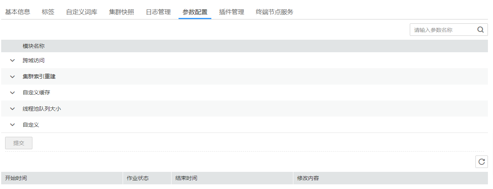

# 参数配置

云搜索服务支持用户通过集群管理页面修改elasticsearch.yml文件的某些配置，修改配置完后需要重启集群才能够使这些配置生效。

## 修改参数配置

1.  登录云搜索服务管理控制台。
2.  在“集群管理“页面，单击需要修改参数配置的集群名称，进入集群基本信息页面。
3.  选择“参数配置“，根据需求，修改对应模块的参数取值。

    **图 1**  参数配置  
    

    **表 1**  模块参数信息说明

    
    <table><thead align="left"><tr id="row103280287249"><th class="cellrowborder" valign="top" width="16.541654165416542%" id="mcps1.2.4.1.1">
模块名称

    </th>
    <th class="cellrowborder" valign="top" width="26.15261526152615%" id="mcps1.2.4.1.2">
参数名称

    </th>
    <th class="cellrowborder" valign="top" width="57.3057305730573%" id="mcps1.2.4.1.3">
说明

    </th>
    </tr>
    </thead>
    <tbody><tr id="row19330192810243"><td class="cellrowborder" rowspan="6" valign="top" width="16.541654165416542%" headers="mcps1.2.4.1.1 ">
跨域访问

    </td>
    <td class="cellrowborder" valign="top" width="26.15261526152615%" headers="mcps1.2.4.1.2 ">
http.cors.allow-credentials

    </td>
    <td class="cellrowborder" valign="top" width="57.3057305730573%" headers="mcps1.2.4.1.3 ">
跨域访问是否返回头部的Access-Control-Allow-Credentials。

    
取值范围：true、false。

    
默认值：false。

    </td>
    </tr>
    <tr id="row1330428132419"><td class="cellrowborder" valign="top" headers="mcps1.2.4.1.1 ">
http.cors.allow-origin

    </td>
    <td class="cellrowborder" valign="top" headers="mcps1.2.4.1.2 ">
允许跨域访问的IP，配置样例如122.122.122.122:9200。

    </td>
    </tr>
    <tr id="row8330728192417"><td class="cellrowborder" valign="top" headers="mcps1.2.4.1.1 ">
http.cors.max-age

    </td>
    <td class="cellrowborder" valign="top" headers="mcps1.2.4.1.2 ">
浏览器默认缓存时间。如果超过设置的时间后，缓存将自动清除。

    
单位：秒。

    
默认值：1728000。

    </td>
    </tr>
    <tr id="row133010281246"><td class="cellrowborder" valign="top" headers="mcps1.2.4.1.1 ">
http.cors.allow-headers

    </td>
    <td class="cellrowborder" valign="top" headers="mcps1.2.4.1.2 ">
跨域访问允许的headers，包括X-Requested-With, Content-Type, Content-Length，中间用英文逗号和空格分开。

    </td>
    </tr>
    <tr id="row123301728142417"><td class="cellrowborder" valign="top" headers="mcps1.2.4.1.1 ">
http.cors.enabled

    </td>
    <td class="cellrowborder" valign="top" headers="mcps1.2.4.1.2 ">
是否允许跨域访问。

    
取值范围：true、false。

    
默认值：false。

    </td>
    </tr>
    <tr id="row833113287248"><td class="cellrowborder" valign="top" headers="mcps1.2.4.1.1 ">
http.cors.allow-methods

    </td>
    <td class="cellrowborder" valign="top" headers="mcps1.2.4.1.2 ">
跨域访问允许的方法，包括OPTIONS, HEAD, GET, POST, PUT, DELETE，中间用英文逗号和空格分开。

    </td>
    </tr>
    <tr id="row12333192812418"><td class="cellrowborder" valign="top" width="16.541654165416542%" headers="mcps1.2.4.1.1 ">
集群索引重建

    </td>
    <td class="cellrowborder" valign="top" width="26.15261526152615%" headers="mcps1.2.4.1.2 ">
reindex.remote.whitelist

    </td>
    <td class="cellrowborder" valign="top" width="57.3057305730573%" headers="mcps1.2.4.1.3 ">
配置该参数可以将本集群数据通过reindex接口迁移到配置的集群，配置样例如122.122.122.122:9200。

    </td>
    </tr>
    <tr id="row12334228112416"><td class="cellrowborder" valign="top" width="16.541654165416542%" headers="mcps1.2.4.1.1 ">
自定义缓存

    </td>
    <td class="cellrowborder" valign="top" width="26.15261526152615%" headers="mcps1.2.4.1.2 ">
indices.queries.cache.size

    </td>
    <td class="cellrowborder" valign="top" width="57.3057305730573%" headers="mcps1.2.4.1.3 ">
查询阶段的缓存大小。

    
取值范围：1-100。

    
单位：%。

    
默认值：10%。

    </td>
    </tr>
    <tr id="row633432813246"><td class="cellrowborder" rowspan="3" valign="top" width="16.541654165416542%" headers="mcps1.2.4.1.1 ">
线程池队列大小

    </td>
    <td class="cellrowborder" valign="top" width="26.15261526152615%" headers="mcps1.2.4.1.2 ">
thread_pool.bulk.queue_size

    </td>
    <td class="cellrowborder" valign="top" width="57.3057305730573%" headers="mcps1.2.4.1.3 ">
Bulk请求的队列大小。输入的参数值为整数类型。

    
默认值：200。

    
当集群版本为7.x之前版本时，显示此参数。

    </td>
    </tr>
    <tr id="row1233416288247"><td class="cellrowborder" valign="top" headers="mcps1.2.4.1.1 ">
thread_pool.write.queue_size

    </td>
    <td class="cellrowborder" valign="top" headers="mcps1.2.4.1.2 ">
线程池写入队列大小。输入的参数值为整数类型。

    
默认值：200。

    
当集群版本为7.x之后版本时，显示此参数。

    </td>
    </tr>
    <tr id="row83359287248"><td class="cellrowborder" valign="top" headers="mcps1.2.4.1.1 ">
thread_pool.force_merge.size

    </td>
    <td class="cellrowborder" valign="top" headers="mcps1.2.4.1.2 ">
用来做forcemerge的队列大小。输入的参数值为整数类型。

    
默认值：1。

    </td>
    </tr>
    <tr id="row103371728132417"><td class="cellrowborder" valign="top" width="16.541654165416542%" headers="mcps1.2.4.1.1 ">
自定义

    </td>
    <td class="cellrowborder" valign="top" width="26.15261526152615%" headers="mcps1.2.4.1.2 ">
用户可以根据实际情况，添加相关参数名称。

    </td>
    <td class="cellrowborder" valign="top" width="57.3057305730573%" headers="mcps1.2.4.1.3 ">
自定义参数的取值。

    
 说明： 
<ul id="ul19337192817245"><li>如果自定义参数有多个取值，则取值的输入格式为[value1, value1, value1...]。</li><li>取值之间用英文逗号和空格隔开。</li><li>自定义参数值中不能包含冒号。</li></ul>
    

    </td>
    </tr>
    </tbody>
    </table>

4.  修改完成后，单击“确认修改“。

    系统弹出确认提示，勾选“参数配置后需要手动重启才能生效”后，单击“确定“。

    您可以在当前页面查看修改记录，系统最多显示20条修改记录。

    > **说明：** 
    >如果修改了参数配置，未重启集群，则在“集群管理“页面的“任务状态“栏显示为“配置未更新“。
    >如果修改后重启集群，“任务状态“显示“配置错误“，则表示修改参数配置文件失败。

