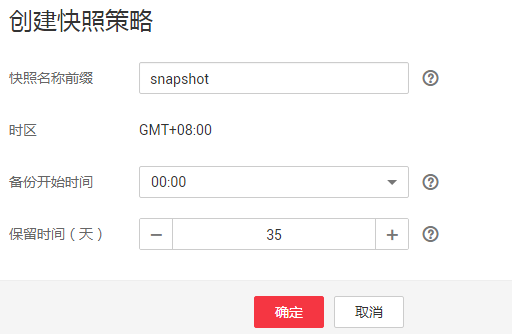

# 备份与恢复索引

为避免数据丢失，您可以将集群的索引数据进行备份，当数据发生丢失或者想找回某一时间段数据时，您可以通过恢复索引操作快速获得数据。索引的备份是通过创建集群快照实现。第一次备份时，建议将所有索引数据进行备份。

> **说明：**   
>备份与恢复索引功能上线之前（即2018年3月10日之前）创建的集群，无法创建快照。  

-   [管理自动创建快照](#section18551039928)：自动创建快照指按照设置的规则，每天在指定时间自动创建快照。您可以开启自动创建功能、设置自动创建的策略、和关闭自动创建功能。
-   [手动创建快照](#section43906502025)：在任意时间，您通过手动创建快照的方式，针对当时的数据或某几个索引创建快照进行备份。
-   [恢复数据](#section16538152014387)：将已有的快照，通过恢复快照功能，将备份的索引数据恢复到指定的集群中。
-   [删除快照](#section3105193716428)：对于已失效的快照，建议删除以释放存储资源。

> **说明：**   
>-   创建快照之前，您需要进行基础配置，包含存储快照的OBS桶、快照的备份路径及安全认证使用的IAM委托。  
>-   集群快照存储的OBS桶，在首次设置后，不管自动创建快照还是手动创建快照，如果快照列表中已有可用的快照，则OBS桶将无法再变更，请谨慎选择存储OBS桶。  
>-   如果OBS桶已经存储了快照，OBS无法变更，您可以使用这个方法修改：首先关闭快照功能，然后再开启快照功能，指定新的OBS桶。  
>    一旦关闭快照功能，之前创建的快照将无法用于恢复集群。  
>-   当集群处于“不可用“状态时，快照功能中，除了恢复快照功能外，其他快照信息或功能只能查看，无法进行编辑。  
>-   备份与恢复过程中，支持集群扩容、访问Kibana、查看监控、删除其他快照的操作。不支持重启此集群、删除此集群、删除正在创建或恢复的快照、再次创建或恢复快照的操作。补充说明，当此集群正在进行创建快照或者恢复快照时，此时，自动创建快照任务将被取消。  

## 前提条件

登录云搜索服务管理控制台的账号或IAM用户必须同时具备如下权限才能使用创建或恢复快照功能。

-   “全局服务“中“对象存储服务“项目的“Tenant Administrator“权限。
-   当前所属区域的“Elasticsearch Administrator“权限。

## 管理自动创建快照

1.  在云搜索服务管理控制台，单击左侧导航栏的“集群管理“。
2.  在“集群管理“页面，单击需要进行备份的集群名称，进入集群信息页面。在集群信息页面，单击“集群快照“页签。

    或者，在“集群管理“页面，单击对应集群“操作“列的“更多\>备份与恢复“，进入“集群快照“管理页面。

3.  在“集群快照“管理页面，在“集群快照开关“右侧单击开关，打开集群快照功能。

    表示关闭集群快照功能，表示打开集群快照功能。

4.  （可选）打开集群快照功能后，云搜索服务会自动为客户创建OBS桶、备份路径和IAM委托，用于存储快照。自动创建的OBS桶、备份路径和IAM委托将直接展示在界面中。如果您不希望使用自动创建的OBS桶、备份路径和IAM委托，您可以在“修改基础配置“右侧单击进行配置。

    在基础配置弹出框中，您可以在下拉框中选择您账户下已有的OBS桶和IAM委托，或者通过“创建桶“和“创建委托“链接重新创建。详细操作步骤请参见[创建桶](https://support.huaweicloud.com/usermanual-obs/zh-cn_topic_0045829088.html)和[如何创建委托](https://support.huaweicloud.com/usermanual-iam/zh-cn_topic_0046613147.html#)。

    **表 1**  参数说明

    
    <table><thead align="left"><tr id="row595810278493"><th class="cellrowborder" valign="top" width="20%" id="mcps1.2.4.1.1">
参数

    </th>
    <th class="cellrowborder" valign="top" width="27.98%" id="mcps1.2.4.1.2">
说明

    </th>
    <th class="cellrowborder" valign="top" width="52.019999999999996%" id="mcps1.2.4.1.3">
注意事项

    </th>
    </tr>
    </thead>
    <tbody><tr id="row296002719498"><td class="cellrowborder" valign="top" width="20%" headers="mcps1.2.4.1.1 ">
“OBS桶”

    </td>
    <td class="cellrowborder" valign="top" width="27.98%" headers="mcps1.2.4.1.2 ">
快照存储的OBS桶的名称。

    </td>
    <td class="cellrowborder" valign="top" width="52.019999999999996%" headers="mcps1.2.4.1.3 ">
创建或者已存在的OBS桶需满足如下条件：

    <ul id="ul196015276499"><li>“存储类别”为“标准存储”或“低频访问存储”。</li><li>“区域”为“华北-北京一”、“华东-上海二”或“华南-广州”。</li></ul>
    </td>
    </tr>
    <tr id="row129610425594"><td class="cellrowborder" valign="top" width="20%" headers="mcps1.2.4.1.1 ">
“备份路径”

    </td>
    <td class="cellrowborder" valign="top" width="27.98%" headers="mcps1.2.4.1.2 ">
快照在OBS桶中的存放路径。

    </td>
    <td class="cellrowborder" valign="top" width="52.019999999999996%" headers="mcps1.2.4.1.3 ">
备份路径配置规则：<ul id="ul16496085211"><li>备份路径不能包括下列符号：\:*?"&lt;&gt;|</li><li>备份路径不能以“/”开头。</li><li>备份路径不能以“.”开头或结尾。</li><li>备份路径的总长度不能超过1023个字符。</li></ul>
    

    </td>
    </tr>
    <tr id="row1996112794910"><td class="cellrowborder" valign="top" width="20%" headers="mcps1.2.4.1.1 ">
“IAM委托”

    </td>
    <td class="cellrowborder" valign="top" width="27.98%" headers="mcps1.2.4.1.2 ">
指当前账户授权云搜索服务访问或维护存储在OBS中数据。

    </td>
    <td class="cellrowborder" valign="top" width="52.019999999999996%" headers="mcps1.2.4.1.3 ">
创建或者已存在的IAM需满足如下条件：

    <ul id="ul29611827194917"><li>“委托类型”选择“云服务”</li><li>“云服务”选择“Elasticsearch”。</li><li>设置当前委托具备“全局服务”中“对象存储服务”项目的“Tenant Administrator”权限。</li></ul>
    </td>
    </tr>
    </tbody>
    </table>

    **图 1**  基础配置  
    

5.  在“自动创建快照“右侧，单击开关开启自动创建快照功能。

    表示打开自动创建快照功能，表示关闭自动创建快照功能。

    **图 2**  开启或关闭功能  
    

6.  在“修改快照策略“页面进行策略设置。

    -   “快照名称前缀“：快照名称由快照名称前缀加上时间组成，例如自动生成的快照名称snapshot-2018022405925。快照名称前缀的长度为1～31个字符，只能包含小写字母、数字、中划线和下划线，且必须以字母开头。
    -   “时区“：指备份时间对应的时区。请基于此时区选择“备份开始时间“。
    -   “备份开始时间“：指每天自动开始备份的时间，只能指定整点时间，如00:00、01:00，取值范围为00:00～23:00。请在下拉框中选择备份时间。
    -   “保留时间（天）“：指备份的快照在OBS的保留时间，以天为单位，取值范围为1～90，您可以根据自己的需求进行设置。系统在半点时刻会自动删除超过保留时间的快照，例如：创建快照的策略设置如[图3](#fig181181934115613)所示，则系统会在35天后的00:30自动删除35天前00:00自动开始备份的快照。

    **图 3**  自动创建快照  
    

7.  设置完成后，单击“保存“。

    自动创建策略配置完成后，策略信息将直接呈现在集群快照页面，如[图4](#fig1963894355013)所示。当业务发生变更，需要修改策略时，您可以单击进行重新设置。

    按照策略自动创建的快照将呈现在快照管理列表中。快照列表同时展示自动创建和手动创建的快照，您可以通过快照类型参数进行区分。在快照列表右上角，您可以输入快照名称或快照ID的关键字进行查找。您还可以通过快照列表表头的按钮根据不同参数进行排序，以便进行快速查找。

    **图 4**  自动创建快照策略  
    

8.  （可选）关闭自动创建快照功能。

    关闭自动创建快照功能后，系统将停止继续自动创建快照。如果系统正在根据策略自动创建快照，而快照列表还未呈现正在创建的快照时，无法关闭自动创建快照功能。如果您单击了关闭按钮，系统将提示您无法关闭。建议等快照自动创建成功后，即快照列表已出现最新创建的快照时，再单击关闭按钮，关闭自动创建快照功能。

    关闭自动创建快照功能时，您可以在弹出窗口中通过“Delete automated snapshots“选项，选择是否立即删除之前已自动创建的快照，默认不勾选。

    -   不勾选：表示不会删除关闭此功能前已自动创建的快照。如果不删除，后续还可以在快照列表中通过删除按钮手动删除，详细操作指导请参见[删除快照](#section3105193716428)。如果未手动删除，且之后用户又重新开启了自动创建快照功能，那么此集群中所有“快照类型“为自动创建的快照（包含开启自动创建快照功能前已存在的自动创建的快照）都无法手动删除，只会被系统自动删除。系统会基于重新开启自动创建快照功能时的配置策略进行自动删除，例如此策略中定义的保留时间为10天，那么系统中超过10天的快照将被系统自动删除。
    -   勾选：表示删除此集群快照列表中所有“快照类型“为自动创建的快照。

## 手动创建快照

1.  在云搜索服务管理控制台，单击左侧导航栏的“集群管理“。
2.  在“集群管理“页面，单击需要进行备份的集群名称，进入集群信息页面。在集群信息页面，单击“集群快照“页签。

    或者，在“集群管理“页面，单击对应集群“操作“列的“更多\>备份与恢复“，进入“集群快照“管理页面。

3.  在“集群快照“管理页面，单击“集群快照开关“右侧的开关，打开集群快照功能。

    表示关闭集群快照功能，表示打开集群快照功能。

4.  （可选）打开集群快照功能后，云搜索服务会自动为客户创建OBS桶、备份路径和IAM委托，用于存储快照。自动创建的OBS桶、备份路径和IAM委托将直接展示在界面中。如果您不希望使用自动创建的OBS桶、备份路径和IAM委托，您可以在“修改基础配置“右侧单击进行配置。基础配置的详细配置指导请参见[4](#li1597517249415)。
5.  完成基础配置后，单击“创建快照“可手动创建。

    -   “快照名称“：手动创建的快照名称，4～64个字符，只能包含小写字母、数字、中划线和下划线，且必须以字母开头。与自动创建不同，手动创建的快照名称按照用户设置的名称，不会自动加上时间信息。
    -   “索引“：手动创建快照可针对集群中某几个索引进行备份，此处填写索引名称。0～1024个字符，不能包含空格和大写字母，且不能包含"\\<|\>/?特殊字符。多个索引之间使用英文逗号隔开。如果不填写，则默认备份集群中所有索引。支持使用“\*“匹配多个索引，例如：2018-06\*，表示备份名称前缀是2018-06的所有索引的数据。

        您可以在Kibana中使用**GET /\_cat/indices**命令，查询集群存在的所有索引名称。在了解了集群的索引后，再填写需要对哪些索引数据创建快照进行备份。

    -   “快照描述“：创建的快照描述信息。0～256个字符，不能包含“<\>“字符。

    **图 5**  手动创建快照  
    

6.  单击“确定“开始创建快照。

    快照创建完成后，将直接呈现在快照管理列表中，快照状态为“可用”表示快照创建成功。快照列表同时展示自动创建和手动创建的快照，您可以通过快照类型参数进行区分。在快照列表右上角，您可以输入快照名称或快照ID的关键字进行查找。您还可以通过快照列表表头的按钮根据不同参数进行排序，以便进行快速查找。

## 恢复数据

快照管理列表中“快照状态“为“可用“的快照，您可以使用快照恢复集群中的数据。已存储快照数据可恢复至其他集群。

恢复数据将覆盖集群中当前的数据，请谨慎操作。

1.  在快照管理页面中，选择需要恢复的快照，单击“操作“列的“恢复“。
2.  在恢复弹出框中，填写如下信息。

    “索引“：指定需要进行恢复的索引名称，默认为空。如保持默认值，即不指定索引名称，则表示恢复所有的索引数据。0～1024个字符，不能包含空格和大写字母，且不能包含"\\<|\>/?特殊字符。

    “索引名称匹配模式“：在恢复时，可以根据文本框中定义的过滤条件去恢复符合条件的索引，过滤条件请使用正则表达式。默认值“index\_\(.+\)“表示所有的索引。0～1024个字符，不能包含空格和大写字母，且不能包含"\\<|\>/?,特殊字符。

    “索引名称替换模式“：索引重命名的规则。默认值“restored\_index\_$1“表示在所有恢复的索引名称前面加上“restored\_“。0～1024个字符，不能包含空格和大写字母，且不能包含"\\<|\>/?,特殊字符。在设置“索引名称替换模式“时，“索引名称匹配模式“和“索引名称替换模式“需要同时设置才会生效。

    “集群“：选择需要进行恢复的集群名称，可选择当前集群或者其他集群。只能选择处于“可用“状态的集群，如果快照所属的集群处于“不可用“状态，那么也无法将快照恢复到本集群。恢复到其他集群时，目标集群中的Elasticsearch版本不低于本集群。如果已选择其他集群，且该集群中存在同名的索引，则恢复完成后，该同名的索引中的数据将会被覆盖，请谨慎操作。

    **图 6**  恢复快照  
    

3.  单击“确定“开始恢复。恢复成功，快照列表中“任务状态“将变更为“恢复成功“，索引数据将根据快照信息重新生成。

    快照列表中，“任务状态“列显示快照最近一次恢复的状态。所有最近一次恢复成功的快照才会显示为“恢复成功“。

    **图 7**  恢复成功  
    

## 删除快照

当快照信息不需要使用时，您可以删除快照释放存储资源。当自动创建快照功能开启时，自动创建的快照无法手动删除，系统会按照设置的策略在半点时刻自动删除超过“保留时间“的快照。当自动创建快照功能关闭，且之前已自动创建的快照并未同步删除时，快照列表中自动创建的快照，可通过删除按钮手动删除。如果未手动删除，且之后用户又重新开启了自动创建快照功能，那么此集群中所有“快照类型“为自动创建的快照（包含开启自动创建快照功能前已存在的自动创建的快照）都无法手动删除，只会被系统自动删除。

> **说明：**   
>快照信息删除后，数据将无法恢复，请谨慎操作。  

1.  在快照管理页面中，选择需要删除的快照，单击“操作“列的“删除“。
2.  在“删除快照“框中单击“确定“删除。

