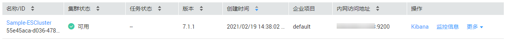

# 快速开始使用Elasticsearch搜索引擎<a name="css_01_0007"></a>

关于云搜索服务的概念、优势、功能和应用场景等，请参见[《云搜索服务产品介绍》](https://support.huaweicloud.com/productdesc-css/css_04_0001.html)。

本章节提供了一个简单示例，详情如[场景描述](#section15177859183319)所示。您可以参考此场景示例数据，使用云搜索服务的Elasticsearch搜索引擎搜索数据，基本操作流程如下所示：

-   [步骤1：创建集群](#section96881833619)
-   [步骤2：导入数据](#section398512163445)
-   [步骤3：搜索数据](#section167624221443)
-   [步骤4：删除集群](#section75027114374)

## 场景描述<a name="section15177859183319"></a>

某女装品牌在网上经营电商业务，其以前是使用传统数据库来为用户提供商品搜索功能，但随着用户数量和业务的增长，使用传统数据库的弊端愈来愈明显。主要问题表现为：响应速度慢、准确性低。为了改善用户体验从而避免用户流失，该电商网站开始使用Elasticsearch搜索引擎来为用户提供商品搜索功能，使用了一段时间后，不仅解决了之前使用传统数据库产生的问题，而且实现了用户数量的增长。

本章节将介绍如何使用Elasticsearch搜索引擎为用户提供搜索功能。

假设该电商网站经营商品的数据如下所示：

```
{
"products":[
{"productName":"2017秋装新款文艺衬衫女装","size":"L"}
{"productName":"2017秋装新款文艺衬衫女装","size":"M"}
{"productName":"2017秋装新款文艺衬衫女装","size":"S"}
{"productName":"2018春装新款牛仔裤女装","size":"M"}
{"productName":"2018春装新款牛仔裤女装","size":"S"}
{"productName":"2017春装新款休闲裤女装","size":"L"}
{"productName":"2017春装新款休闲裤女装","size":"S"}
]
}
```

## 步骤1：创建集群<a name="section96881833619"></a>

在开始搜索数据之前，您需要创建一个集群，其搜索引擎为Elasticsearch。例如，您可以创建一个名称为“Sample-ESCluster“的集群。此集群仅用于入门指导使用，建议选用“节点规格“为“ess.spec-2u16g”，“节点存储“为“高I/O“，“节点存储容量“为“40GB“。详细操作步骤请参见[创建集群](创建集群.md)。

集群创建完成后，在集群列表查看已创建的集群，集群状态为“可用”表示集群创建成功。如[图1](#fig44331131151411)所示。

**图 1**  创建集群<a name="fig44331131151411"></a>  


## 步骤2：导入数据<a name="section398512163445"></a>

云搜索服务支持通过云数据迁移（简称CDM）、数据接入服务（简称DIS）、Logstash、Kibana或API将数据导入到Elasticsearch。其中Kibana是Elasticsearch的图形化界面，便于交互验证，因此，这里以Kibana为例介绍将数据导入到Elasticsearch的操作流程。

1.  在云搜索服务的“集群管理“页面上，单击集群“操作“列的“Kibana“访问集群。

    

2.  在Kibana的左侧导航中选择“Dev Tools”，单击“Get to work“，进入Console界面，如[图2](#fig221172817246)所示。

    Console左侧区域为输入框，右侧为结果输出区域。

    **图 2**  Console界面<a name="fig221172817246"></a>  
    

3.  在Console界面，执行如下命令创建索引“my\_store“。

    ```
    PUT /my_store
    {
      "settings": {
        "number_of_shards": 1
      },
      "mappings": {
        "products": {
          "properties": {
            "productName": {
              "type": "text",
              "analyzer": "ik_smart"
            },
            "size": {
              "type": "keyword"
            }
          }
        }
      }
    }
    ```

    返回结果如[图3](#fig421152812246)所示。

    **图 3**  执行创建索引命令后的返回结果<a name="fig421152812246"></a>  
    

4.  在Console界面，执行如下命令，将数据导入到“my\_store“索引中。

    ```
    POST /my_store/products/_bulk
    {"index":{}}
    {"productName":"2017秋装新款文艺衬衫女装","size":"L"}
    {"index":{}}
    {"productName":"2017秋装新款文艺衬衫女装","size":"M"}
    {"index":{}}
    {"productName":"2017秋装新款文艺衬衫女装","size":"S"}
    {"index":{}}
    {"productName":"2018春装新款牛仔裤女装","size":"M"}
    {"index":{}}
    {"productName":"2018春装新款牛仔裤女装","size":"S"}
    {"index":{}}
    {"productName":"2017春装新款休闲裤女装","size":"L"}
    {"index":{}}
    {"productName":"2017春装新款休闲裤女装","size":"S"}
    ```

    当返回结果信息中“errors“字段的值为“false“时，表示导入数据成功。


## 步骤3：搜索数据<a name="section167624221443"></a>

-   **全文检索**

    假设用户进入该电商网站，她想要查找名称包含“春装牛仔裤”的商品信息，可以搜索“春装牛仔裤”。这里使用Kibana演示用户搜索数据在后台的执行命令和返回结果。

    执行命令如下所示。

    ```
    GET /my_store/products/_search
    {
      "query": {"match": {
        "productName": "春装牛仔裤"
      }}
    }
    ```

    返回结果如[图4](#fig38028585148)所示。

    **图 4**  执行全文检索命令后的返回结果<a name="fig38028585148"></a>  
    

    -   Elasticsearch支持分词，上面执行命令会将“春装牛仔裤”分词为“春装”和“牛仔裤”。
    -   Elasticsearch支持全文检索，上面执行命令会在所有商品信息中搜索包含“春装”或“牛仔裤”的商品信息。
    -   Elasticsearch与传统数据库不同，它能借助倒排索引在毫秒级返回结果。
    -   Elasticsearch支持评分排序，在上面返回结果中，前两条商品信息中同时出现了“春装”和“牛仔裤”，后两条商品信息中只出现了“春装”，所以前两条比后两条与检索关键词的匹配度更高，分数更高，排序也更靠前。


-   **聚合结果显示**

    该电商网站可以提供聚合结果显示功能，例如： 对“春装”对应的产品按照尺码分类，统计不同尺码的数量。这里使用Kibana演示聚合结果显示功能在后台的执行命令和返回结果。

    执行命令如下所示。

    ```
    GET /my_store/products/_search
    {
    "query": {
    "match": { "productName": "春装" }
    },
    "size": 0,
    "aggs": {
    "sizes": {
    "terms": { "field": "size" }
    }
    }
    }
    ```

    返回结果如[图5](#fig275934121813)所示。

    **图 5**  执行聚合结果显示命令后的返回结果<a name="fig275934121813"></a>  
    


## 步骤4：删除集群<a name="section75027114374"></a>

当您已完全了解Elasticsearch搜索引擎的使用流程和方法后，您可以参考如下步骤，删除示例集群以及示例数据，避免造成资源浪费。

由于集群删除后，数据无法恢复，请谨慎操作。

1.  登录云搜索服务管理控制台。在左侧菜单栏选择“集群管理“。
2.  进入集群管理页面，选中“Sample-ESCluster“集群所在行，在操作列单击“更多\>删除“。
3.  在弹出的确认对话框中，单击“确定“完成操作。

