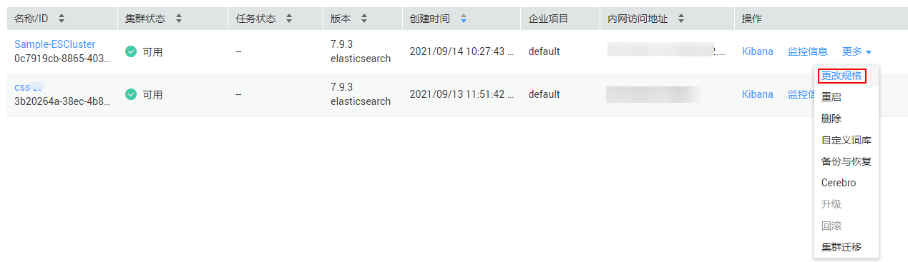

# 扩容集群

当集群节点不满足业务所需时，可使用扩容功能增加节点，以提高存储和使用效率。

## 操作步骤

1.  登录云搜索服务管理控制台。
2.  单击“集群管理“进入集群列表页面，选中需要扩容的集群，在其“操作“列中单击“更改规格“。
3.  在进入的更改集群规格页面中设置所需的“扩容后的节点数量“和“节点存储容量“。

    请至少增加1个节点，且最大为32个节点。新增节点的“节点规格“、“节点存储“与创建集群时相同。

    > **说明：**   
    >“节点存储容量“参数最多只能修改6次。  

    **图 1**  更改规格  
    

4.  单击“立即申请“。
5.  在“规格确认“页面，确认更改的规格后，单击“提交申请“。
6.  单击“返回集群列表“跳转到集群管理页面。“任务状态“列中显示为“扩容“，表示集群正在扩容。

    **图 2**  任务状态  
    

