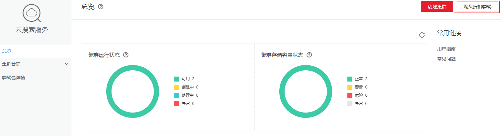

# 折扣套餐

> **说明：** 
>如果您之前购买了折扣套餐，现在需要购买相同的套餐，但是资源显示**已售罄**，您还可以继续购买使用。如果您之前没有购买折扣套餐，现在购买**已售罄**的资源，则不能享受折扣套餐，请谨慎购买。

云搜索服务同时提供折扣套餐计费方式，根据购买服务的时长一次性为节点、存储或者带宽支付费用。最短时长为1个月，最长时长为1年。对于长期使用者，推荐该方式。折扣套餐计费方式具备如下优势：

-   价格优惠

    折扣套餐的单月价格比按需计费的月度价格低了40%，而且购买时长为10个月时，还可以免费赠送2个月。

-   与集群不存在绑定关系

    用户可以在折扣套餐的使用时长内随时删除已有集群，创建与折扣套餐中区域、节点规格、节点存储类型或带宽类型相同的其他集群，并继续使用该对应的折扣套餐。

    折扣套餐和节点实例、节点存储类型以及带宽不存在绑定关系，举例如下：

    1.  如果您的集群节点实例、节点存储类型或者带宽目前是按需计费，在您购买对应规格的折扣套餐后，系统自动会按折扣套餐方式计费，您不用再做任何关联操作。
    2.  购买折扣套餐后不会自动创建云搜索服务集群，用户需要前往**云搜索服务**界面自行创建对应区域的节点规格、节点存储类型或者带宽类型与购买的折扣套餐相同的集群。
    3.  如果您的集群需要扩容，新扩容的节点默认优先扣减已购买的对应节点实例规格、节点存储和带宽折扣套餐的配额。为了避免影响其他已购买的节点实例的套餐配额，建议您再次购买和新扩容节点个数、规格、节点存储类型、带宽类型相同的折扣套餐，这样新的节点也可以按照优惠价格收费。
    4.  如果创建了和已删除的集群所包含的节点实例规格、节点存储类型、带宽相同的新集群，那么折扣套餐仍可以在新集群上使用。

-   集群扩容无忧兼容

    由于折扣套餐扣费时，是根据购买时长进行扣费，因此当集群需要扩容时，对于需要扩容的节点，用户可以购买与扩容节点类型、节点存储类型相同的折扣套餐，既划算，又简便。

    折扣套餐适用于节点实例，节点存储类型，带宽类型相同的集群，相对于按需计费提供更大的折扣，对于长期使用者，推荐该方式。

    折扣套餐计费方式是用户预先购买一定的云搜索服务节点实例，存储类型或者带宽类型使用小时数配额，在使用过程中，系统优先扣减折扣套餐所购买的配额，配额内使用量不再收费，超出配额的使用量以按需计费方式收费。

    > **须知：** 
    >-   折扣套餐费用为一次性支付，即刻生效，暂不支持指定日期生效。
    >-   购买的折扣套餐在有效期内，系统会优先扣除折扣套餐内的额度，超出部分以按需计费方式进行结算。
    >-   折扣套餐和具体的区域和节点规格绑定，购买的折扣套餐只能使用在对应的区域和规格的节点上。
    >-   折扣套餐和具体的区域和节点存储绑定，购买的折扣套餐只能使用在对应的区域和存储类型的节点上。
    >-   折扣套餐和具体的区域和带宽类型绑定，购买的折扣套餐只能使用在对应的区域和带宽类型的节点上。

## 操作步骤

1.  登录云搜索服务管理控制台。
2.  在“总览”页面，单击“购买折扣套餐”。

    **图 1**  购买折扣套餐  
    

3.  在“购买折扣套餐”页面，选择“当前区域”。

    **表 1**  参数说明

    
    <table><thead align="left"><tr id="zh-cn_topic_0175160159_zh-cn_topic_0105656584_row17393844111015"><th class="cellrowborder" valign="top" width="34.43%" id="mcps1.2.3.1.1">
参数名

    </th>
    <th class="cellrowborder" valign="top" width="65.57%" id="mcps1.2.3.1.2">
参数解释

    </th>
    </tr>
    </thead>
    <tbody><tr id="zh-cn_topic_0175160159_zh-cn_topic_0105656584_row73935445102"><td class="cellrowborder" valign="top" width="34.43%" headers="mcps1.2.3.1.1 ">
当前区域

    </td>
    <td class="cellrowborder" valign="top" width="65.57%" headers="mcps1.2.3.1.2 ">
集群节点实际工作区域。

    </td>
    </tr>
    </tbody>
    </table>

4.  选择“资源类型”。

    **表 2**  参数说明

    
    <table><thead align="left"><tr id="zh-cn_topic_0175160159_zh-cn_topic_0105656584_row67181421587"><th class="cellrowborder" valign="top" width="18.790000000000003%" id="mcps1.2.3.1.1">
参数名

    </th>
    <th class="cellrowborder" valign="top" width="81.21000000000001%" id="mcps1.2.3.1.2">
参数解释

    </th>
    </tr>
    </thead>
    <tbody><tr id="zh-cn_topic_0175160159_zh-cn_topic_0105656584_row1871818423582"><td class="cellrowborder" valign="top" width="18.790000000000003%" headers="mcps1.2.3.1.1 ">
资源类型

    </td>
    <td class="cellrowborder" valign="top" width="81.21000000000001%" headers="mcps1.2.3.1.2 ">
目前支持节点、存储和带宽三种类型。

    <ul id="zh-cn_topic_0175160159_ul199040422011"><li>节点：集群中每个节点的vCPU与内存资源。
您可以选择任一系列，然后从对应系列中根据需要选择一个规格。每个集群只能选择一个规格，规格的详细说明可参考<a href="https://support.huaweicloud.com/productdesc-ecs/zh-cn_topic_0035470096.html" target="_blank" rel="noopener noreferrer">弹性云服务器的实例类型与规格</a>。您不能选择已售罄的CPU和内存资源。

    </li></ul>
    <ul id="zh-cn_topic_0175160159_ul1546661672012"><li>存储：节点的存储容量。当前支持三种存储类型，普通I/O、高I/O、超高I/O。
每一种存储类型都提供了40GB，100 GB，500GB，1TB，2TB，5TB，10TB，20TB，50TB九种规格的存储容量。

    
 说明： 
<ul id="zh-cn_topic_0175160159_ul111241263315"><li>存储折扣套餐可用存储配额为存储容量 * 768小时(默认一个月按768小时计算) * 购买数量。</li><li>只要创建集群所选择的存储类型与购买的存储折扣套装中的存储类型相同，不管存储容量是多少，都可以进行抵扣。</li></ul>
    

    </li><li>带宽：带宽大小。云搜索服务支持两种带宽类型，低带宽(1~5Mbit/s )、高带宽(6~100Mbit/s )类型。
当您对集群开通公网访问功能时，会产生带宽计费。

    
 说明： 
<ul id="zh-cn_topic_0175160159_ul119117509352"><li>带宽折扣套餐可用存储配额为带宽大小 * 768小时(默认一个月按768小时计算) * 购买数量。</li><li>只要集群绑定的带宽类型相同，不管带宽为多少，都可以进行抵扣。例如，购买2个1 Mbit/s带宽，时长为一个月的折扣套餐费用和购买一个时长为一个月的2 Mbit/s带宽，可以进行抵扣，因为他们的带宽类型都属于低带宽。但是购买2个5 Mbit/s带宽，时长为一个月的折扣套餐和购买一个时长为一个月的10 Mbit/s带宽，则不能进行抵扣，因为5 Mbit/s带宽属于低带宽类型，而10 Mbit/s带宽则属于高带宽类型。</li></ul>
    

    </li></ul>
    </td>
    </tr>
    </tbody>
    </table>

5.  设置“购买时长”。
6.  设置“购买数量”。
7.  （可选）选择企业项目。

    在购买折扣套餐时，选择企业项目，则购买的折扣套餐归属于该企业项目。企业项目的详细信息请参考[绑定企业项目](https://support.huaweicloud.com/usermanual-css/css_01_0058.html)。

    > **说明：** 
    >-   设置“购买时长”和“购买数量”参数后，系统会自动计算出配置费用。
    >-   在“配置费用”的下方，您可以单击“了解计费详情”，在弹出的“产品价格详情”页面中，查看云搜索服务的计费详情。

8.  单击“立即购买”。
9.  确认订单详情无误后，单击“去支付”。
10. 选择如下任一方式付款：余额支付和在线支付。
11. 付款。

    > **说明：** 
    >用户购买折扣套餐后不能自助退订，只能提交工单给客服人员申请退订。退还金额需根据用户使用折扣套餐的情况而定。

    -   如果已选择余额支付方式，且当前可用余额大于配置费用，则单击“确认付款”。
    -   如果已选择在线支付方式，则单击“下一步”，然后选择在线支付的具体支付方式，单击“确认支付”。

    折扣套餐购买成功后系统不会自动创建集群，您需要前往云搜索服务管理控制台创建与折扣套餐中区域、节点规格、节点存储类型或带宽类型相同的集群才能使用该折扣套餐，创建集群的具体操作步骤请参见《云搜索服务用户指南》中的[创建集群](https://support.huaweicloud.com/usermanual-css/css_01_0011.html)章节。

