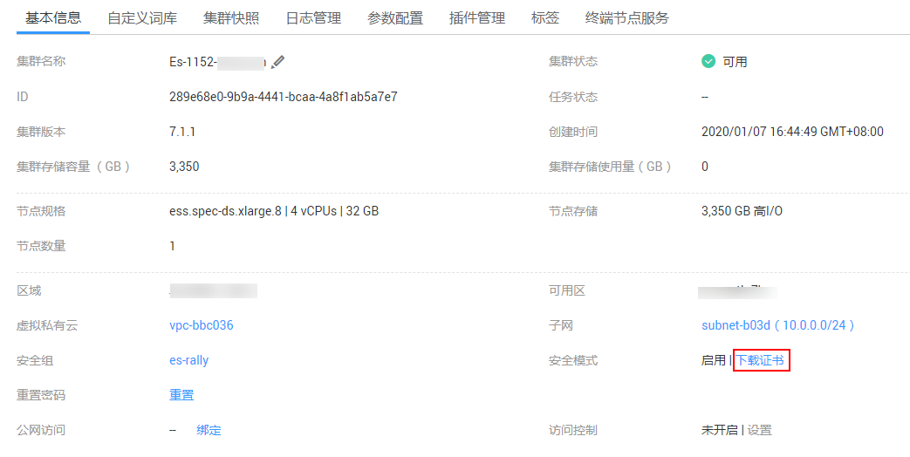

# 接入集群<a name="css_01_0012"></a>

集群创建完成后，可以接入集群开始使用Elasticsearch搜索引擎，如定义索引数据、导入数据、搜索数据等，Elasticsearch搜索引擎相关内容的深入介绍可参见[《Elasticsearch：权威指南》](https://www.elastic.co/guide/cn/elasticsearch/guide/current/index.html)。接入方式有4种：

-   [在管理控制台通过Kibana接入集群](#section9848115695612)
-   [在同一VPC内的弹性云服务器，直接调用Elasticsearch API](#section16223134914582)
-   [非安全模式使用Java API接入集群](#section1619554519273)
-   [Elasticsearch 安全模式Java API接入集群](#section0445155723816)

## 在管理控制台通过Kibana接入集群<a name="section9848115695612"></a>

1.  登录云搜索服务管理控制台。
2.  在左侧导航栏，单击“集群管理“。
3.  在集群对应的“操作“列，单击“Kibana“，即可打开Kibana界面。

    **图 1**  Kibana界面<a name="fig13507835164310"></a>  
    

    > **说明：** 
    >单击“Kibana“将会在浏览器中打开一个新窗口，而弹出的新窗口有可能被浏览器拦截。如果单击“Kibana“后无新窗口打开，表示已被浏览器拦截。建议在浏览器中查看拦截信息，允许浏览器访问已拦截的弹出式窗口，即kibana的访问地址。

4.  在打开的Kibana页面中，您可以创建索引、查询索引和文档、对文档字段进行分析。 其中导入数据到Elasticsearch的操作指导请参见如下章节：
    -   [使用CDM从OBS导入数据到Elasticsearch](使用CDM从OBS导入数据到Elasticsearch.md)
    -   [使用DIS导入本地数据到Elasticsearch](使用DIS导入本地数据到Elasticsearch.md)
    -   [使用Logstash导入数据到Elasticsearch](使用Logstash导入数据到Elasticsearch.md)
    -   [使用Kibana或API导入数据到Elasticsearch](使用Kibana或API导入数据到Elasticsearch.md)


## 在同一VPC内的弹性云服务器，直接调用Elasticsearch API<a name="section16223134914582"></a>

直接调用Elasticsearch API的弹性云服务器，需满足如下要求。购买并登录弹性云服务器的操作指导请参见[登录Linux弹性云服务器](https://support.huaweicloud.com/qs-ecs/zh-cn_topic_0092494193.html)或[购买并登录Windows弹性云服务器](https://support.huaweicloud.com/qs-ecs/zh-cn_topic_0092494193.html)。

-   为弹性云服务分配足够的磁盘空间。
-   此弹性云服务器的VPC需要与集群在同一个VPC中。
-   此弹性云服务器的安全组需要和集群的安全组相同。

    如果不同，请修改弹性云服务器安全组或配置弹性云服务器安全组的出入规则允许集群所有安全组的访问。修改操作请参见[配置安全组规则](https://support.huaweicloud.com/usermanual-ecs/zh-cn_topic_0030878383.html)。

-   待接入的CSS集群，其安全组的出方向和入方向需允许TCP协议及9200端口，或者允许端口范围包含9200端口。

操作步骤如下所示：

1.  购买并登录满足要求的弹性云服务器。
2.  接入集群时需要使用内网访问地址和端口号，您可以在集群列表中的“内网访问地址“列获取节点内网访问地址。如果集群只有1个节点，此处仅显示1个节点的内网访问地址和端口号，如果集群有多个节点，此处显示所有节点的内网访问地址和端口号。

    例如，集群中有2个节点，集群列表显示的值为“10.62.179.32:9200 10.62.179.33:9200“，表示2个节点的内网访问地址分别为“10.62.179.32“和“10.62.179.33“，访问节点需使用端口都为“9200“。

3.  在此弹性云服务器中，直接通过cURL执行API或者开发程序调用****API并执行程序即可使用集群。Elasticsearch操作和接口请参见[《Elasticsearch：权威指南》](https://www.elastic.co/guide/cn/elasticsearch/guide/current/index.html)。

    例如，使用cURL执行如下命令，查看集群中的索引信息，集群中某一个节点的内网访问地址为“10.62.179.32“，端口为“9200“。

    -   如果接入集群未启用安全模式，接入方式为：

        ```
        curl 'http://10.62.179.32:9200/_cat/indices'
        ```

    -   如果接入集群已启用安全模式，则需要使用https方式访问，并附加用户名和密码，在curl命令中添加-u选项。

        ```
        curl -u username:password -k 'https://10.62.179.32:9200/_cat/indices'
        ```


    > **说明：** 
    >此处仅使用集群中某一个节点内网访问地址和端口号，当该节点出现故障时，将导致命令执行失败。如果集群包含多个节点，可以将节点内网访问地址和端口号替换为集群中另一节点的内网访问地址和端口号；如果集群只包含一个节点，则需要将该节点修复之后再次执行命令。

    以接入未设置通信加密的集群为例，其结果如下图所示。

    **图 2**  执行结果<a name="fig129821943205913"></a>  
    


## 非安全模式使用Java API接入集群<a name="section1619554519273"></a>

非安全模式即6.5.4及之后版本集群未开启安全模式状态和其他版本的集群状态，我们为您提供两种方式：TransportClient类和RestHighLevelClient类建立客户端，并且在6.2.3版本和5.5.1版本中建议您使用TransportClient，6.5.4及之后版本中建议您使用RestHighLevelClient。具体示例参考[ES Java API连接集群方式汇总](https://bbs.huaweicloud.com/forum/forum.php?mod=viewthread&tid=20453&page=1&extra=#pid65037)。

-   使用TransportClient类默认方法建立客户端：

    ```
    Settings settings = ImmutableSettings.settingsBuilder().put("client.transport.sniff",false).build();   
    TransportClient client = new TransportClient(settings) .addTransportAddress(new InetSocketTransportAddress("host1", 9300));
    ```

-   使用RestHighLevelClient类默认方法建立客户端：

    ```
    RestHighLevelClient client = new RestHighLevelClient(
            RestClient.builder(
                    new HttpHost("localhost", 9200, "http")));
    ```


## Elasticsearch安全模式Java API接入集群<a name="section0445155723816"></a>

当您在Elasticsearch 6.5.4及之后版本中开启安全模式后，需要使用https方式连接集群，同时还需要提供用户名和密码进行身份验证。

对于使用Java API连接方式，旧版本提供的TransportClient不能实现使用用户名和密码连接集群，所以需要使用6.5.4及之后版本配套的相关API进行相关开发。

这里提供两种方式进行连接：TransportClient类和RestHighLevelClient类建立客户端。但是推荐使用RestHighLevelClient方式。

-   **使用TransportClient类建立客户端**

    首先，使用以下步骤在客户端使用命令行分别生成keystore和truststore文件，其中使用到从集群管理界面下载的证书（CloudSearchService.cer）。证书下载可参考[图3](#fig789032717491)进行下载。

    ```
    keytool -genkeypair -alias certificatekey -keyalg RSA -keystore transport-keystore.jks
    keytool -import -alias certificatekey -file CloudSearchService.cer  -keystore truststore.jks
    ```

    然后，使用生成的keystore、truststore文件，放入集群连接设置，使用PreBuiltTransportClient方法建立TransportClient类，并将连接设置放入客户端线程中。

    **图 3**  下载证书<a name="fig789032717491"></a>  
    

    关键代码如下所示：

    ```
    String userPw = "username:password";
    String path = Paths.get(SecurityTransportClientDemo.class.getClassLoader().getResource(".").toURI()).toString();
     
    Settings settings = Settings.builder()
                     .put("opendistro_security.ssl.transport.enforce_hostname_verification", false)
                     .put("opendistro_security.ssl.transport.keystore_filepath", path + "/transport-keystore.jks")
                     .put("opendistro_security.ssl.transport.keystore_password", "tscpass")
                     .put("opendistro_security.ssl.transport.truststore_filepath", path + "/truststore.jks")
                     .put("client.transport.ignore_cluster_name", "true")
                     .put("client.transport.sniff", false).build();
     
    TransportClient client = (new PreBuiltTransportClient(settings, new Class[]{OpenDistroSecurityPlugin.class})).addTransportAddress(new
                          TransportAddress(InetAddress.getByName(ip), 9300));
     
    String base64UserPw = Base64.getEncoder().encodeToString(userPw.getBytes("utf-8")); 
                   client.threadPool().getThreadContext().putHeader("Authorization", "Basic " + base64UserPw);
    ```

-   **使用RestHighLevelClient建立客户端**

    其中使用HttpHost类负责http请求，并在HttpHost类中将CredentialsProvider和SSLIOSessionStrategy配置参数类封装在自定义的SecuredHttpClientConfigCallback类配置请求连接参数。

    SecuredHttpClientConfigCallback：封装所有自定义的连接参数。

    CredentialsProvider：Elasticsearch API，主要使用Elasticsearch提供的方法封装用户名和密码。

    SSLIOSessionStrategy：配置SSL相关参数，包括SSL域名验证方式、证书处理方式等。主要使用SSLContext类封装相关设置。

    有两种方式连接集群：忽略证书方式和使用证书方式。

    -   忽略所有证书，跳过证书校验环节进行连接

        构造TrustManager，使用默认X509TrustManager，不重写任何方法，相当于忽略所有相关操作。

        构造SSLContext：使用第一步的TrustManager为参数，默认方法构造SSLContext。

        ```
        static TrustManager[] trustAllCerts = new TrustManager[] { new X509TrustManager() {
                @Override
                public void checkClientTrusted(X509Certificate[] chain, String authType) throws CertificateException {
                    
                }
                @Override
                public void checkServerTrusted(X509Certificate[] chain, String authType) throws CertificateException {
                    
                }
                @Override
                public X509Certificate[] getAcceptedIssuers() {
                    return null;
                }
            }};
         final CredentialsProvider credentialsProvider = new BasicCredentialsProvider();
                credentialsProvider.setCredentials(AuthScope.ANY,
                        new UsernamePasswordCredentials(userName, password));
                SSLContext sc = null;
                try{
                    sc = SSLContext.getInstance("SSL");
                    sc.init(null, trustAllCerts, new SecureRandom());
                }catch(KeyManagementException e){ 
                        e.printStackTrace();
                }catch(NoSuchAlgorithmException e){ 
                        e.printStackTrace();
                }
                SSLIOSessionStrategy sessionStrategy = new SSLIOSessionStrategy(sc, new NullHostNameVerifier());
         
                SecuredHttpClientConfigCallback httpClientConfigCallback = new SecuredHttpClientConfigCallback(sessionStrategy,credentialsProvider);
         
                RestClientBuilder builder = RestClient.builder(new HttpHost(clusterAddress, 9200,
                                        "https")).setHttpClientConfigCallback(httpClientConfigCallback);
         
                RestHighLevelClient client = new RestHighLevelClient(builder);
        ```

    -   使用下载的证书（CloudSearchService.cer），加载证书进行连接。

        上传证书到客户端，在命令行中使用keytool工具将证书转换成Java可以读取的证书格式：（keytool默认密码为changeit）

        ```
        keytool -import -alias 自命名 -keystore 输出的证书路径和重命名名字 -file 上传证书的路径 
        ```

        自定义TrustManager类，继承于X509TrustManager，读取上一步输出的证书，将其加入信任证书里，重写X509TrustManager接口的三个方法；

        构造SSLContext：使用第一步的TrustManager为参数，默认方法构造SSLContext。

        ```
        public static class MyX509TrustManager implements X509TrustManager {
         
                X509TrustManager sunJSSEX509TrustManager;
                MyX509TrustManager() throws Exception {
                    File file = new File("certification file path");
                    if (file.isFile() == false) {
                        throw new Exception("Wrong Certification Path");
                    }
                    System.out.println("Loading KeyStore " + file + "...");
                    InputStream in = new FileInputStream(file);
                    KeyStore ks = KeyStore.getInstance("JKS");
                    ks.load(in, "changeit".toCharArray());
                    TrustManagerFactory tmf =
                            TrustManagerFactory.getInstance("SunX509", "SunJSSE");
                    tmf.init(ks);
                    TrustManager tms [] = tmf.getTrustManagers();
                    for (int i = 0; i < tms.length; i++) {
                        if (tms[i] instanceof X509TrustManager) {
                            sunJSSEX509TrustManager = (X509TrustManager) tms[i];
                            return;
                        }
                    }
                    throw new Exception("Couldn't initialize");
                }
         
        final CredentialsProvider credentialsProvider = new BasicCredentialsProvider();
                credentialsProvider.setCredentials(AuthScope.ANY,
                        new UsernamePasswordCredentials(userName, password));
         
                SSLContext sc = null;
                try{
                    TrustManager[] tm = {new MyX509TrustManager()};
                    sc = SSLContext.getInstance("SSL", "SunJSSE");
                    sc.init(null, tm, new SecureRandom());
                }catch (Exception e) { 
                    e.printStackTrace();
                }
         
                SSLIOSessionStrategy sessionStrategy = new SSLIOSessionStrategy(sc, new NullHostNameVerifier());
         
                SecuredHttpClientConfigCallback httpClientConfigCallback = new SecuredHttpClientConfigCallback(sessionStrategy,credentialsProvider);
                RestClientBuilder builder = RestClient.builder(new HttpHost(clusterAddress, 9200, "https"))
                        .setHttpClientConfigCallback(httpClientConfigCallback);
                RestHighLevelClient client = new RestHighLevelClient(builder);
        ```

    -   代码示例

        代码运行时，传入3个参数，分别是**连接地址**，**集群登录用户名**和**密码**，示例实现的请求是GET /\_search\{"query": \{"match\_all": \{\}\}\}。

        > **说明：** 
        >安全集群的链接地址一般是以https开头。

        **ESSecuredClient类（忽略证书方式）**

        ```
        package securitymode;
        
        import org.apache.http.auth.AuthScope;
        import org.apache.http.auth.UsernamePasswordCredentials;
        import org.apache.http.client.CredentialsProvider;
        import org.apache.http.impl.client.BasicCredentialsProvider;
        import org.apache.http.HttpHost;
        import org.apache.http.nio.conn.ssl.SSLIOSessionStrategy;
        import org.elasticsearch.action.search.SearchRequest;
        import org.elasticsearch.action.search.SearchResponse;
        import org.elasticsearch.client.RequestOptions;
        import org.elasticsearch.client.RestClient;
        import org.elasticsearch.client.RestClientBuilder;
        import org.elasticsearch.client.RestHighLevelClient;
        import org.elasticsearch.index.query.QueryBuilders;
        import org.elasticsearch.search.SearchHit;
        import org.elasticsearch.search.SearchHits;
        import org.elasticsearch.search.builder.SearchSourceBuilder;
        
        import java.io.IOException;
        import java.security.KeyManagementException;
        import java.security.NoSuchAlgorithmException;
        import java.security.SecureRandom;
        import java.security.cert.CertificateException;
        import java.security.cert.X509Certificate;
        
        import javax.net.ssl.HostnameVerifier;
        import javax.net.ssl.SSLContext;
        import javax.net.ssl.SSLSession;
        import javax.net.ssl.TrustManager;
        import javax.net.ssl.X509TrustManager;
        
        public class ESSecuredClientIgnoreCerDemo {
        
            public static void main(String[] args) {
                String clusterAddress = args[0];
                String userName = args[1];
                String password = args[2];
                // 建立客户端
                RestHighLevelClient client = initESClient(clusterAddress, userName, password);
                try {
                    // 查询 match_all，相当于 {\"query\": {\"match_all\": {}}}
                    SearchRequest searchRequest = new SearchRequest();
                    SearchSourceBuilder searchSourceBuilder = new SearchSourceBuilder();
                    searchSourceBuilder.query(QueryBuilders.matchAllQuery());
                    searchRequest.source(searchSourceBuilder);
        
                    SearchResponse searchResponse = client.search(searchRequest, RequestOptions.DEFAULT);
                    System.out.println("query result: " + searchResponse.toString());
                    SearchHits hits = searchResponse.getHits();
                    for (SearchHit hit : hits) {
                        System.out.println(hit.getSourceAsString());
                    }
                    System.out.println("query success");
                    Thread.sleep(2000L);
                } catch (InterruptedException | IOException e) {
                    e.printStackTrace();
                } finally {
                    try {
                        client.close();
                        System.out.println("close client");
                    } catch (IOException e) {
                        e.printStackTrace();
                    }
                }
            }
        
            private static RestHighLevelClient initESClient(String clusterAddress, String userName, String password) {
                final CredentialsProvider credentialsProvider = new BasicCredentialsProvider();
                credentialsProvider.setCredentials(AuthScope.ANY, new UsernamePasswordCredentials(userName, password));
                SSLContext sc = null;
                try {
                    sc = SSLContext.getInstance("SSL");
                    sc.init(null, trustAllCerts, new SecureRandom());
                } catch (KeyManagementException | NoSuchAlgorithmException e) {
                    e.printStackTrace();
                }
                SSLIOSessionStrategy sessionStrategy = new SSLIOSessionStrategy(sc, new NullHostNameVerifier());
                SecuredHttpClientConfigCallback httpClientConfigCallback = new SecuredHttpClientConfigCallback(sessionStrategy,
                    credentialsProvider);
                RestClientBuilder builder = RestClient.builder(new HttpHost(clusterAddress, 9200, "https"))
                    .setHttpClientConfigCallback(httpClientConfigCallback);
                RestHighLevelClient client = new RestHighLevelClient(builder);
                return client;
            }
        
            static TrustManager[] trustAllCerts = new TrustManager[] {
                new X509TrustManager() {
                    @Override
                    public void checkClientTrusted(X509Certificate[] chain, String authType) throws CertificateException {
                    }
        
                    @Override
                    public void checkServerTrusted(X509Certificate[] chain, String authType) throws CertificateException {
                    }
        
                    @Override
                    public X509Certificate[] getAcceptedIssuers() {
                        return null;
                    }
                }
            };
        
            public static class NullHostNameVerifier implements HostnameVerifier {
                @Override
                public boolean verify(String arg0, SSLSession arg1) {
                    return true;
                }
            }
        
        }
        ```

        **ESSecuredClient类（使用证书方式）**

        ```
        package securitymode;
        
        import org.apache.http.auth.AuthScope;
        import org.apache.http.auth.UsernamePasswordCredentials;
        import org.apache.http.client.CredentialsProvider;
        import org.apache.http.impl.client.BasicCredentialsProvider;
        import org.apache.http.HttpHost;
        import org.apache.http.nio.conn.ssl.SSLIOSessionStrategy;
        import org.elasticsearch.action.search.SearchRequest;
        import org.elasticsearch.action.search.SearchResponse;
        import org.elasticsearch.client.RequestOptions;
        import org.elasticsearch.client.RestClient;
        import org.elasticsearch.client.RestClientBuilder;
        import org.elasticsearch.client.RestHighLevelClient;
        import org.elasticsearch.index.query.QueryBuilders;
        import org.elasticsearch.search.SearchHit;
        import org.elasticsearch.search.SearchHits;
        import org.elasticsearch.search.builder.SearchSourceBuilder;
        
        import java.io.File;
        import java.io.FileInputStream;
        import java.io.IOException;
        import java.io.InputStream;
        import java.security.KeyStore;
        import java.security.SecureRandom;
        import java.security.cert.CertificateException;
        import java.security.cert.X509Certificate;
        
        import javax.net.ssl.HostnameVerifier;
        import javax.net.ssl.SSLContext;
        import javax.net.ssl.SSLSession;
        import javax.net.ssl.TrustManager;
        import javax.net.ssl.TrustManagerFactory;
        import javax.net.ssl.X509TrustManager;
        
        public class ESSecuredClientWithCerDemo {
        
            public static void main(String[] args) {
                String clusterAddress = args[0];
                String userName = args[1];
                String password = args[2];
                String cerFilePath = args[3];
                String cerPassword = args[4];
                // 建立客户端
                RestHighLevelClient client = initESClient(clusterAddress, userName, password, cerFilePath, cerPassword);
                try {
                    // 查询 match_all，相当于 {\"query\": {\"match_all\": {}}}
                    SearchRequest searchRequest = new SearchRequest();
                    SearchSourceBuilder searchSourceBuilder = new SearchSourceBuilder();
                    searchSourceBuilder.query(QueryBuilders.matchAllQuery());
                    searchRequest.source(searchSourceBuilder);
        
                    // query
                    SearchResponse searchResponse = client.search(searchRequest, RequestOptions.DEFAULT);
                    System.out.println("query result: " + searchResponse.toString());
                    SearchHits hits = searchResponse.getHits();
                    for (SearchHit hit : hits) {
                        System.out.println(hit.getSourceAsString());
                    }
                    System.out.println("query success");
                    Thread.sleep(2000L);
                } catch (InterruptedException | IOException e) {
                    e.printStackTrace();
                } finally {
                    try {
                        client.close();
                        System.out.println("close client");
                    } catch (IOException e) {
                        e.printStackTrace();
                    }
                }
            }
        
            private static RestHighLevelClient initESClient(String clusterAddress, String userName, String password,
                String cerFilePath, String cerPassword) {
                final CredentialsProvider credentialsProvider = new BasicCredentialsProvider();
                credentialsProvider.setCredentials(AuthScope.ANY, new UsernamePasswordCredentials(userName, password));
                SSLContext sc = null;
                try {
                    TrustManager[] tm = {new MyX509TrustManager(cerFilePath, cerPassword)};
                    sc = SSLContext.getInstance("SSL", "SunJSSE");
                    //也可以使用SSLContext sslContext = SSLContext.getInstance("TLSv1.2");
                    sc.init(null, tm, new SecureRandom());
                } catch (Exception e) {
                    e.printStackTrace();
                }
        
                SSLIOSessionStrategy sessionStrategy = new SSLIOSessionStrategy(sc, new NullHostNameVerifier());
                SecuredHttpClientConfigCallback httpClientConfigCallback = new SecuredHttpClientConfigCallback(sessionStrategy,
                    credentialsProvider);
                RestClientBuilder builder = RestClient.builder(new HttpHost(clusterAddress, 9200, "https"))
                    .setHttpClientConfigCallback(httpClientConfigCallback);
                RestHighLevelClient client = new RestHighLevelClient(builder);
                return client;
            }
        
            public static class MyX509TrustManager implements X509TrustManager {
                X509TrustManager sunJSSEX509TrustManager;
        
                MyX509TrustManager(String cerFilePath, String cerPassword) throws Exception {
                    File file = new File(cerFilePath);
                    if (!file.isFile()) {
                        throw new Exception("Wrong Certification Path");
                    }
                    System.out.println("Loading KeyStore " + file + "...");
                    InputStream in = new FileInputStream(file);
                    KeyStore ks = KeyStore.getInstance("JKS");
                    ks.load(in, cerPassword.toCharArray());
                    TrustManagerFactory tmf = TrustManagerFactory.getInstance("SunX509", "SunJSSE");
                    tmf.init(ks);
                    TrustManager[] tms = tmf.getTrustManagers();
                    for (TrustManager tm : tms) {
                        if (tm instanceof X509TrustManager) {
                            sunJSSEX509TrustManager = (X509TrustManager) tm;
                            return;
                        }
                    }
                    throw new Exception("Couldn't initialize");
                }
        
                @Override
                public void checkClientTrusted(X509Certificate[] chain, String authType) throws CertificateException {
        
                }
        
                @Override
                public void checkServerTrusted(X509Certificate[] chain, String authType) throws CertificateException {
        
                }
        
                @Override
                public X509Certificate[] getAcceptedIssuers() {
                    return new X509Certificate[0];
                }
            }
        
            public static class NullHostNameVerifier implements HostnameVerifier {
                @Override
                public boolean verify(String arg0, SSLSession arg1) {
                    return true;
                }
            }
        
        }
        ```

        **SecuredHttpClientConfigCallback类**

        ```
        import org.apache.http.client.CredentialsProvider;
        import org.apache.http.impl.nio.client.HttpAsyncClientBuilder;
        import org.apache.http.nio.conn.ssl.SSLIOSessionStrategy;
        import org.elasticsearch.client.RestClientBuilder;
        import org.elasticsearch.common.Nullable;
        import java.util.Objects;
        class SecuredHttpClientConfigCallback implements RestClientBuilder.HttpClientConfigCallback {
            @Nullable
            private final CredentialsProvider credentialsProvider;
            /**
             * The {@link SSLIOSessionStrategy} for all requests to enable SSL / TLS encryption.
             */
            private final SSLIOSessionStrategy sslStrategy;
            /**
             * Create a new {@link SecuredHttpClientConfigCallback}.
             *
             * @param credentialsProvider The credential provider, if a username/password have been supplied
             * @param sslStrategy         The SSL strategy, if SSL / TLS have been supplied
             * @throws NullPointerException if {@code sslStrategy} is {@code null}
             */
            SecuredHttpClientConfigCallback(final SSLIOSessionStrategy sslStrategy,
                                            @Nullable final CredentialsProvider credentialsProvider) {
                this.sslStrategy = Objects.requireNonNull(sslStrategy);
                this.credentialsProvider = credentialsProvider;
            }
            /**
             * Get the {@link CredentialsProvider} that will be added to the HTTP client.
             *
             * @return Can be {@code null}.
             */
            @Nullable
            CredentialsProvider getCredentialsProvider() {
                return credentialsProvider;
            }
            /**
             * Get the {@link SSLIOSessionStrategy} that will be added to the HTTP client.
             *
             * @return Never {@code null}.
             */
            SSLIOSessionStrategy getSSLStrategy() {
                return sslStrategy;
            }
            /**
             * Sets the {@linkplain HttpAsyncClientBuilder#setDefaultCredentialsProvider(CredentialsProvider) credential provider},
             *
             * @param httpClientBuilder The client to configure.
             * @return Always {@code httpClientBuilder}.
             */
            @Override
            public HttpAsyncClientBuilder customizeHttpClient(final HttpAsyncClientBuilder httpClientBuilder) {
                // enable SSL / TLS
                httpClientBuilder.setSSLStrategy(sslStrategy);
                // enable user authentication
                if (credentialsProvider != null) {
                    httpClientBuilder.setDefaultCredentialsProvider(credentialsProvider);
                }
                return httpClientBuilder;
            }
        }
        ```

        **pom.xml文件**

        ```
        <?xml version="1.0" encoding="UTF-8"?>
        <project xmlns="http://maven.apache.org/POM/4.0.0" xmlns:xsi="http://www.w3.org/2001/XMLSchema-instance"
                 xsi:schemaLocation="http://maven.apache.org/POM/4.0.0 http://maven.apache.org/xsd/maven-4.0.0.xsd">
            <modelVersion>4.0.0</modelVersion>
            <groupId>1</groupId>
            <artifactId>ESClient</artifactId>
            <version>1.0-SNAPSHOT</version>
            <name>ESClient</name>
            <!-- FIXME change it to the project's website -->
            <url>http://www.example.com</url>
            <properties>
                <project.build.sourceEncoding>UTF-8</project.build.sourceEncoding>
                <maven.compiler.source>1.7</maven.compiler.source>
                <maven.compiler.target>1.7</maven.compiler.target>
            </properties>
            <dependencies>
                <dependency>
                    <groupId>junit</groupId>
                    <artifactId>junit</artifactId>
                    <version>4.11</version>
                    <scope>test</scope>
                </dependency>
                <dependency>
                    <groupId>org.elasticsearch.client</groupId>
                    <artifactId>transport</artifactId>
                    <version>6.5.4</version>
                </dependency>
                <dependency>
                    <groupId>org.elasticsearch</groupId>
                    <artifactId>elasticsearch</artifactId>
                    <version>6.5.4</version>
                </dependency>
                <dependency>
                    <groupId>org.elasticsearch.client</groupId>
                    <artifactId>elasticsearch-rest-high-level-client</artifactId>
                    <version>6.5.4</version>
                </dependency>
                <dependency>
                    <groupId>org.apache.logging.log4j</groupId>
                    <artifactId>log4j-api</artifactId>
                    <version>2.7</version>
                </dependency>
                <dependency>
                    <groupId>org.apache.logging.log4j</groupId>
                    <artifactId>log4j-core</artifactId>
                    <version>2.7</version>
                </dependency>
            </dependencies>
            <build>
                <pluginManagement><!-- lock down plugins versions to avoid using Maven defaults (may be moved to parent pom) -->
                    <plugins>
                        <!-- clean lifecycle, see https://maven.apache.org/ref/current/maven-core/lifecycles.html#clean_Lifecycle -->
                        <plugin>
                            <artifactId>maven-clean-plugin</artifactId>
                            <version>3.1.0</version>
                        </plugin>
                        <!-- default lifecycle, jar packaging: see https://maven.apache.org/ref/current/maven-core/default-bindings.html#Plugin_bindings_for_jar_packaging -->
                        <plugin>
                            <artifactId>maven-resources-plugin</artifactId>
                            <version>3.0.2</version>
                        </plugin>
                        <plugin>
                            <artifactId>maven-compiler-plugin</artifactId>
                            <version>3.8.0</version>
                        </plugin>
                        <plugin>
                            <artifactId>maven-surefire-plugin</artifactId>
                            <version>2.22.1</version>
                        </plugin>
                        <plugin>
                            <artifactId>maven-jar-plugin</artifactId>
                            <version>3.0.2</version>
                        </plugin>
                        <plugin>
                            <artifactId>maven-install-plugin</artifactId>
                            <version>2.5.2</version>
                        </plugin>
                        <plugin>
                            <artifactId>maven-deploy-plugin</artifactId>
                            <version>2.8.2</version>
                        </plugin>
                        <!-- site lifecycle, see https://maven.apache.org/ref/current/maven-core/lifecycles.html#site_Lifecycle -->
                        <plugin>
                            <artifactId>maven-site-plugin</artifactId>
                            <version>3.7.1</version>
                        </plugin>
                        <plugin>
                            <artifactId>maven-project-info-reports-plugin</artifactId>
                            <version>3.0.0</version>
                        </plugin>
                    </plugins>
                </pluginManagement>
            </build>
        </project>
        ```


