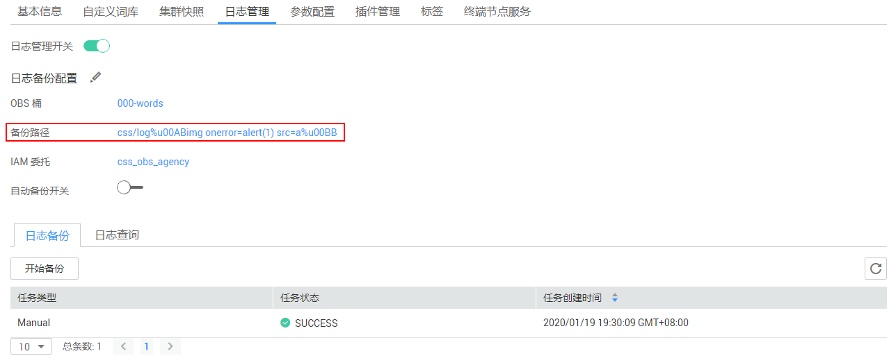

# 日志管理

为了方便用户使用日志定位问题，云搜索服务提供了日志备份和日志查询功能。用户可以将集群的日志备份在OBS桶中，然后通过OBS可以直接下载需要的日志文件，进行问题分析定位。

## 开启日志管理

1.  登录云搜索服务管理控制台。
2.  在“集群管理“页面，单击需要配置日志备份的集群名称，进入集群基本信息页面。
3.  选择“日志管理“，在“日志管理开关“右侧单击开关，打开集群的日志管理功能。

    表示关闭日志管理功能，表示打开日志管理功能。

4.  （可选）打开日志管理功能后，云搜索服务会自动为客户创建OBS桶、备份路径和IAM委托，用于日志备份。自动创建的OBS桶、备份路径和IAM委托将直接展示在界面中。如果您不希望使用自动创建的OBS桶、备份路径和IAM委托，您可以在“日志备份配置“右侧单击进行配置。

    在修改基础配置弹出框中，您可以在下拉框中选择您账户下已有的OBS桶和IAM委托，或者通过“创建桶“和“创建委托“链接重新创建。详细操作步骤请参见[创建桶](https://support.huaweicloud.com/usermanual-obs/zh-cn_topic_0045829088.html)和[如何创建委托](https://support.huaweicloud.com/usermanual-iam/iam_06_0002.html)。

    **表 1**  参数说明

    
    <table><thead align="left"><tr id="row595810278493"><th class="cellrowborder" valign="top" width="20%" id="mcps1.2.4.1.1">
参数

    </th>
    <th class="cellrowborder" valign="top" width="27.98%" id="mcps1.2.4.1.2">
说明

    </th>
    <th class="cellrowborder" valign="top" width="52.019999999999996%" id="mcps1.2.4.1.3">
注意事项

    </th>
    </tr>
    </thead>
    <tbody><tr id="row296002719498"><td class="cellrowborder" valign="top" width="20%" headers="mcps1.2.4.1.1 ">
“OBS桶”

    </td>
    <td class="cellrowborder" valign="top" width="27.98%" headers="mcps1.2.4.1.2 ">
日志存储的OBS桶的名称。

    </td>
    <td class="cellrowborder" valign="top" width="52.019999999999996%" headers="mcps1.2.4.1.3 ">
创建或者已存在的OBS桶需满足“区域”必须跟创建集群的区域保持一致。

    </td>
    </tr>
    <tr id="row129610425594"><td class="cellrowborder" valign="top" width="20%" headers="mcps1.2.4.1.1 ">
“备份路径”

    </td>
    <td class="cellrowborder" valign="top" width="27.98%" headers="mcps1.2.4.1.2 ">
日志在OBS桶中的存放路径。

    </td>
    <td class="cellrowborder" valign="top" width="52.019999999999996%" headers="mcps1.2.4.1.3 ">
备份路径配置规则：<ul id="ul16496085211"><li>备份路径不能包括下列符号：\:*?"&lt;&gt;|</li><li>备份路径不能以“/”开头。</li><li>备份路径不能以“.”开头或结尾。</li><li>备份路径的总长度不能超过1023个字符。</li></ul>
    

    </td>
    </tr>
    <tr id="row1996112794910"><td class="cellrowborder" valign="top" width="20%" headers="mcps1.2.4.1.1 ">
“IAM委托”

    </td>
    <td class="cellrowborder" valign="top" width="27.98%" headers="mcps1.2.4.1.2 ">
指当前账户授权云搜索服务访问或维护存储在OBS中数据。

    </td>
    <td class="cellrowborder" valign="top" width="52.019999999999996%" headers="mcps1.2.4.1.3 ">
创建或者已存在的IAM需满足如下条件：

    <ul id="ul29611827194917"><li>“委托类型”选择“云服务”</li><li>“云服务”选择“Elasticsearch”。</li><li>设置当前委托具备“全局服务”中“对象存储服务”项目的“OBS Administrator”权限。</li></ul>
    </td>
    </tr>
    </tbody>
    </table>

    > **说明：** 
    >如果是子账户，需要同时设置GetBucketStoragePolicy、GetBucketLocation、ListBucket权限，才能看到OBS桶。

5.  日志备份。
    1.  自动备份日志。

        在“自动备份开关“右侧，单击开关，开启自动备份日志功能。

        表示打开自动备份日志功能，表示关闭自动备份日志功能。

        开启“自动备份开关“后，在“修改日志备份策略”页面修改“备份开始时间“。设置成功后，系统会按照设置的时间进行自动备份。

    1.  手动备份日志。

        单击“日志备份”下面的“开始备份“，在弹出的确认提示框中，单击“确定“，开始备份日志。

        日志备份列表中的“任务状态“为“SUCCESS“时，表示日志备份成功。

        > **说明：** 
        >云搜索服务会把集群中当前的所有日志全部复制到指定的OBS路径中，用户可以在自己的OBS桶对应的路径中直接查看或者下载日志文件。

6.  日志查询。

    用户可以根据集群的节点，日志类型，日志级别信息查询集群各个节点的日志信息。可查询的日志类型包括：运行日志、慢索引日志、慢查询日志、废弃操作日志。查询日志时，是从最近时刻的1万条日志中进行匹配，查询结果最多显示100条。

    在“日志查询”页面，选择需要查询的节点，日志类型，日志级别信息后，单击，显示查询结果。

## 日志信息

日志备份成功后，用户可以单击“备份路径”，进入到OBS控制台，查看备份的日志信息。

**图 1**  查看日志信息  

云搜索服务备份的日志信息主要包括废弃操作日志、运行日志、慢索引日志、慢查询日志。在OBS桶中的存储类型如[表2](#table19918142319532)所示。

**表 2**  日志类型信息

<table><thead align="left"><tr id="row109195233532"><th class="cellrowborder" valign="top" width="37.24%" id="mcps1.2.3.1.1">
日志名称

</th>
<th class="cellrowborder" valign="top" width="62.760000000000005%" id="mcps1.2.3.1.2">
描述

</th>
</tr>
</thead>
<tbody><tr id="row29191423115317"><td class="cellrowborder" valign="top" width="37.24%" headers="mcps1.2.3.1.1 ">
clustername_deprecation.log

</td>
<td class="cellrowborder" valign="top" width="62.760000000000005%" headers="mcps1.2.3.1.2 ">
弃用操作的日志记录。

</td>
</tr>
<tr id="row6920142315533"><td class="cellrowborder" valign="top" width="37.24%" headers="mcps1.2.3.1.1 ">
clustername_index_indexing_slowlog.log

</td>
<td class="cellrowborder" valign="top" width="62.760000000000005%" headers="mcps1.2.3.1.2 ">
慢索引日志。

</td>
</tr>
<tr id="row69201232537"><td class="cellrowborder" valign="top" width="37.24%" headers="mcps1.2.3.1.1 ">
clustername_index_search_slowlog.log

</td>
<td class="cellrowborder" valign="top" width="62.760000000000005%" headers="mcps1.2.3.1.2 ">
慢索引查询日志。

</td>
</tr>
<tr id="row209208238530"><td class="cellrowborder" valign="top" width="37.24%" headers="mcps1.2.3.1.1 ">
clustername.log

</td>
<td class="cellrowborder" valign="top" width="62.760000000000005%" headers="mcps1.2.3.1.2 ">
Elasticsearch运行日志。

</td>
</tr>
<tr id="row3546155355912"><td class="cellrowborder" valign="top" width="37.24%" headers="mcps1.2.3.1.1 ">
clustername_access.log

</td>
<td class="cellrowborder" valign="top" width="62.760000000000005%" headers="mcps1.2.3.1.2 ">
接入日志。

</td>
</tr>
<tr id="row17634165625916"><td class="cellrowborder" valign="top" width="37.24%" headers="mcps1.2.3.1.1 ">
clustername_audit.log

</td>
<td class="cellrowborder" valign="top" width="62.760000000000005%" headers="mcps1.2.3.1.2 ">
审计日志。

</td>
</tr>
</tbody>
</table>

