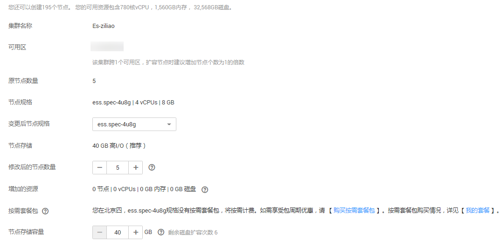

# 更改规格

当创建的集群规格不能满足业务需求时，您可以通过更改规格，对已经创建的集群规格进行修改，以提高存储和使用效率。

## 更改集群规格

1.  登录云搜索服务管理控制台。
2.  单击“集群管理“，进入集群列表页面，选择需要更改规格的集群，在其“操作“列中单击“更改规格“。
3.  在“更改集群规格”页面，设置所需“扩容后的节点数量“和“节点存储容量“。

    如果集群未启用Master节点或Client节点，此时更改集群节点数量或节点存储容量，请至少增加1个节点，且节点数量最大为32个节点。

    如果此集群已启用Master节点或Client节点，您还可以更改Master节点数量和Client节点数量或节点存储容量。请至少增加1个节点，且集群节点数量最大为200个节点，Master节点数量最大为9个节点，Client节点数量最大为32个节点。

    > **说明：**   
    >-   如果只新增节点数量，则新增节点的“节点规格“、“节点存储容量“与创建集群时相同。  
    >-   如果即新增节点数量，又增加节点存储容量，则新增节点的“节点规格“与创建集群时相同，集群的所有节点的存储容量将统一更改为变更后的节点存储容量  
    >-   如果只更改“节点存储容量“，则集群的所有节点的存储容量将统一更改为变更后的节点存储容量。  
    >-   “节点存储容量“参数最多只能修改6次。  

    **图 1**  更改集群规格  
    

4.  单击“立即创建“。
5.  在“集群详情“页面，确认更改的规格后，单击“提交申请“。
6.  单击“返回集群列表“跳转到集群管理页面。“任务状态“列中显示为“扩容“，表示集群正在更改规格。当集群状态变为“可用”，则表示规格更改成功。

## 更改集群节点规格

> **说明：**   
>-   只支持拥有3个及以上节点的集群更改节点规格。  
>-   只支持集群节点规格向大更改。  
>-   此功能上线之前创建的集群不支持更改节点规格。  
>-   更改规格过程中，Kibana不可用。  
>-   变更节点规格不能与“扩容后的节点数量”和“节点存储容量”同时操作。  
>-   如果数据量比较大的情况下，更改节点规格耗时会比较长。  

1.  登录云搜索服务管理控制台。
2.  单击“集群管理“，进入集群列表页面，选择需要更改规格的集群，在其“操作“列中单击“更改规格“。
3.  在“更改集群规格”页面，设置所需的“变更后节点规格“。
4.  单击“立即创建“。
5.  在“集群详情“页面，确认更改的规格后，单击“提交申请“。
6.  单击“返回集群列表“跳转到集群管理页面。“任务状态“列中显示为“规格修改“，表示集群正在更改规格。当集群状态变为“可用”，则表示规格更改成功。

