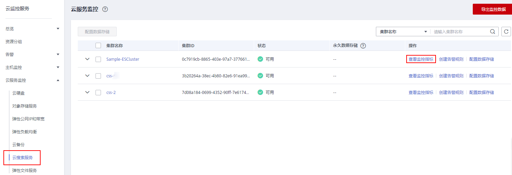

# 查看监控指标

提供的云监控服务可以对云搜索服务集群的核心指标进行日常监控。您可以通过云监控服务管理控制台直观地查看集群的监控指标数据。

云监控服务只支持实时监控已创建成功的集群。

## 前提条件

-   集群状态为“可用“或“处理中“。

    > **说明：** 
    >“异常“、“创建中“状态的集群或者已删除的集群，无法在云监控服务管理控制台中查看其监控指标。当集群状态由“异常“或“创建中“变为“可用“时，该集群需要正常运行一段时间（约10分钟），才可以实时查看其监控指标。

-   集群已正常运行一段时间（约10分钟）。
-   已创建告警规则。

## 操作步骤

1.  登录管理控制台。
2.  选择“管理与部署 \> 云监控服务“。
3.  在左侧导航树栏，选择“云服务监控 \> 云搜索服务“。
4.  在监控列表中待查看的集群所在行的“操作“列，单击“查看监控指标“。

    **图 1**  查看监控指标  
    

5.  选择待查看的时间段页签。
6.  查看监控指标数据。

