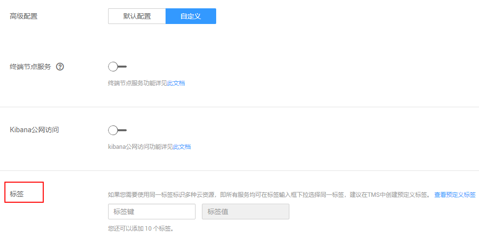
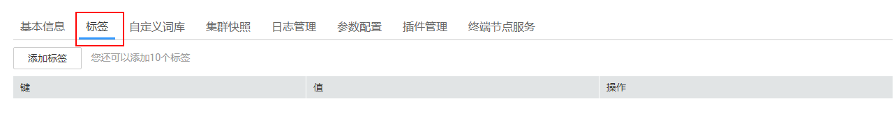

# 标签管理

标签是集群的标识。为集群添加标签，可以方便用户识别和管理拥有的集群资源。

您可以在创建集群时添加标签，也可以在集群创建完成后，在集群的详情页添加标签。

## 为集群添加标签

1.  登录云搜索服务管理控制台。
2.  在创建集群页面，“高级配置“选择“自定义“后，为集群添加标签。

    您可以选择预定义标签，并为此标签设置“标签值“。您可以单击“查看预定义标签“，进入“标签管理服务“，了解此用户下已有的标签。

    您也可以自定义“标签键“和“标签值“。

    **图 1**  创建集群时添加标签  
    

    云搜索服务的每个集群最多可以设置10个标签。当设置不正确时，可单击标签右侧的“删除“按钮，删除此标签。当不设置标签时，可保持为空。

    **表 1**  标签命名规则

    
    <table><thead align="left"><tr id="row1919519393281"><th class="cellrowborder" valign="top" width="31.46%" id="mcps1.2.3.1.1">
参数

    </th>
    <th class="cellrowborder" valign="top" width="68.54%" id="mcps1.2.3.1.2">
说明

    </th>
    </tr>
    </thead>
    <tbody><tr id="row8196173913287"><td class="cellrowborder" valign="top" width="31.46%" headers="mcps1.2.3.1.1 ">
标签键

    </td>
    <td class="cellrowborder" valign="top" width="68.54%" headers="mcps1.2.3.1.2 ">
不能为空。

    
对于同一个集群，标签键值唯一。

    
长度不超过36个字符。

    
只能包含数字、英文字母、下划线、中划线和中文。

    </td>
    </tr>
    <tr id="row12196113942818"><td class="cellrowborder" valign="top" width="31.46%" headers="mcps1.2.3.1.1 ">
标签值

    </td>
    <td class="cellrowborder" valign="top" width="68.54%" headers="mcps1.2.3.1.2 ">
长度不超过43个字符。

    
只能包含数字、英文字母、下划线、中划线和中文。

    
不能为空。

    </td>
    </tr>
    </tbody>
    </table>

## 通过标签搜索集群

1.  登录云搜索服务管理控制台。
2.  在集群管理页面，单击集群列表右上角的“标签搜索“。
3.  输入需要搜索的标签键和标签值。

    标签键和标签值仅支持从下拉列表中选择，当标签键和标签值全匹配时，系统可以自动查询到目标集群。当有多个标签条件时，会取各个标签的交集，进行集群查询。

    系统最多支持10个不同标签的组合搜索。

4.  单击“搜索“。

    系统根据标签键和标签值搜索目标集群。

## 已有集群标签管理

您可以对已经创建的集群的标签进行修改，删除，也可以添加标签。

1.  登录云搜索服务管理控制台。
2.  在集群管理页面，单击待管理标签的集群名称。

    系统跳转至该集群“基本信息“页面。

3.  选择“标签”，在此可以对集群标签进行添加，修改，删除操作。

    **图 2**  已有集群添加标签  
    

    -   查看

        在“标签”页，可以查看当前集群的标签详情，包括标签个数，以及每个标签的键和值。

    -   添加

        单击左上角的“添加标签”，在弹出的“添加标签”窗口，输入新添加标签的键和值，并单击“确定”。

    -   修改

        只能修改已有标签的标签值。

        单击标签所在行“操作”列下的“编辑”，在弹出的“编辑标签”窗口，输入修改后标签值，并单击“确定”。

    -   删除

        单击标签所在行“操作”列下的“删除”，如果确认删除，在弹出的“删除标签”窗口，单击“确定”。

