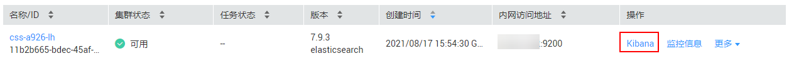

# 登录Kibana

## 前提条件

已创建CSS集群，详细请参考[创建集群](https://support.huaweicloud.com/usermanual-css/css_01_0011.html)。

## 操作步骤

-   通过控制台访问方式登录
    1.  登录云搜索服务管理控制台。
    2.  在“集群管理“页面选择需要登录Kibana的集群，单击该集群“操作“列中的“Kibana“，即可登录Kibana操作界面。

        **图 1**  登录Kibana界面  
        

        > **说明：** 
        >如果您开启了安全模式，登录时候，需要输入用户名和密码。用户名一般为admin，密码为创建集群时设置的密码。
        >如果忘记密码，可以在集群详情页面修改密码后登录。修改密码详细请参考[安全模式集群简介](https://support.huaweicloud.com/productdesc-css/css_04_0019.html#section4)。

    3.  登录成功后，可在Kibana界面进行相关操作。

-   通过公网访问方式登录

    如果您在创建集群时候，开启了Kibana公网访问功能，则可以通过Kibana公网访问地址进行登录。详细请参考[Kibana公网访问](https://support.huaweicloud.com/usermanual-css/css_01_0088.html)。

