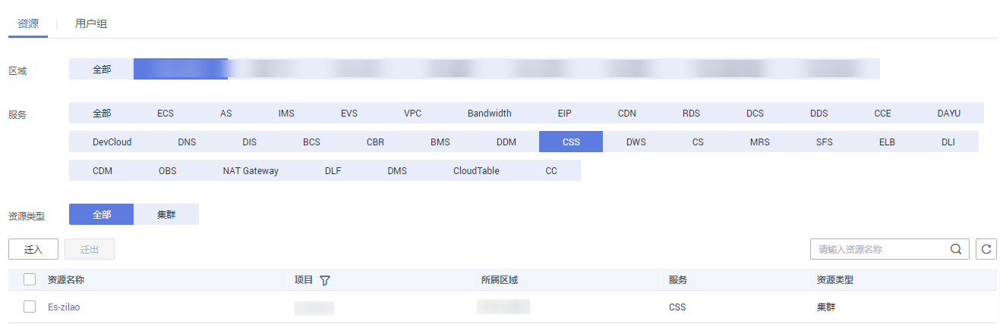
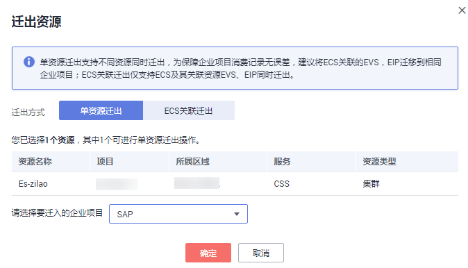
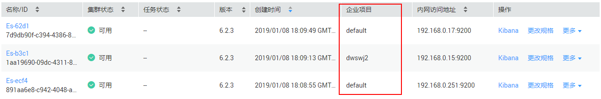
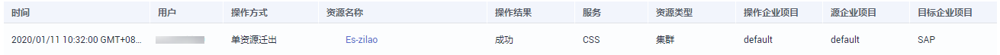

# 绑定企业项目

每个集群必须设置其对应的企业项目，如果不需要此参数进行区分时，您可以将集群绑定至“default“项目。对于绑定企业项目特性上线前创建的集群，集群的企业项目将被绑定至“default“项目。您可以根据实际情况修改绑定企业项目。

## 绑定企业项目

在创建集群时，您可以在企业项目参数中绑定，详细操作步骤及参数解释请参见[创建集群](创建集群.md)。

## 修改企业项目

针对之前已创建的集群，其绑定的企业项目可根据实际情况进行修改。

1.  在“云搜索服务“管理控制台，单击“集群管理“进入集群列表。
2.  在集群列表中，单击集群名称进入集群详情页面。
3.  在集群详情页面中，单击“企业项目“参数右侧的参数值，进入“企业管理服务“的“企业项目管理“页面。
4.  在资源页签下，选择对应“区域“，然后在“产品类型“中选择“CSS“服务。此时，资源列表将筛选出对应的CSS集群。

    **图 1**  筛选CSS集群  
    

5.  勾选需要修改企业项目的集群，然后单击“迁出“。
6.  在“迁出资源“页面，选择“迁出方式“，再选择“迁入的企业项目“，然后单击“确定“。

    **图 2**  迁出资源  
    

7.  迁出完成后，在原始的企业项目资源页面中，无法再获取此集群信息。您可以通过两种方式查看此集群绑定的企业项目。
    -   进入云搜索服务集群列表页面，此集群对应的“企业项目“列的值，将更换为修改后的企业项目。

        **图 3**  查看集群对应的企业项目  
        

    -   在企业管理服务中，在左侧导航栏选择“企业项目管理 \> 企业项目列表“，在对应的企业项目行中，单击“查看资源“。在资源列表中，可获取到此集群的信息。

        **图 4**  查看资源  
        

