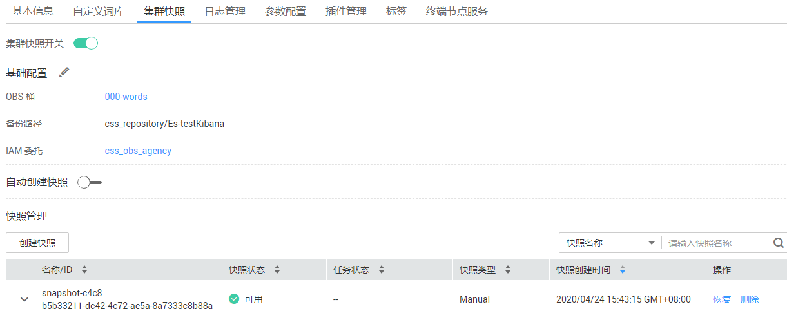
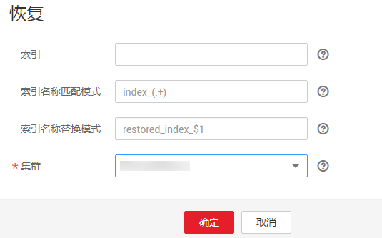

# 迁移集群

将一个集群的数据迁移到另一个集群，我们称之为集群迁移。集群迁移的应用场景很多，如当业务数据不断增加时，无法直接修改当前集群的规格以便满足需求时，可以选择创建一个规格较高的集群，然后通过集群迁移的操作，快速将数据全部迁移至新集群中，以满足业务需求。另一个场景，如通过集群迁移可将两个集群的索引合并到一个集群中，以满足业务的需要。在云搜索服务中，通过备份与恢复索引功能可实现集群迁移，即将一个集群的快照恢复到另一个集群。

本文以将集群“Es-1“中的数据迁移到集群“Es-2“为例。其中“Es-2“集群的版本高于“Es-1“集群，且节点数要高于“Es-1“节点数的1/2。

## 操作步骤

1.  在集群管理界面中，单击集群名称“Es-1“进入集群详情页。然后，选择“集群快照“页签。

    **图 1**  集群详情  
    

2.  单击“创建快照“手动创建快照，在弹出框中输入快照名称并单击“提交“，等待快照创建完成。

    首次使用备份与恢复索引功能，需要先进行基础配置，详见请参见[手动创建快照](备份与恢复索引.md#section43906502025)。

    **图 2**  创建快照  
    

    快照创建完成后，如[图3](#fig14397673517)所示。

    **图 3**  快照创建成功  
    

3.  在快照管理页面，单击该快照操作列的“恢复“按钮，将数据恢复至Es-2集群。

    -   在“索引“的文本框中输入“\*“，表示对集群“Es-1“的全部索引进行恢复。
    -   在“集群“的下拉框中选择“Es-2“，将该快照恢复到集群“Es-2“中。

    最后单击“恢复“按钮开始恢复。当然还可以进行对恢复之后的索引重命名等操作，详情请参见[备份与恢复索引](备份与恢复索引.md)。

    **图 4**  恢复数据  
    

4.  恢复完成后，即完成了集群“Es-1“中的数据到集群“Es-2“的迁移。

