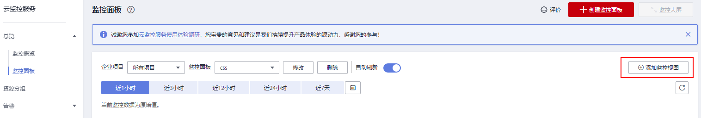

# 配置监控对象

云搜索服务集群创建成功后，有时候想要查看集群或者单节点的监控指标时，可以通过云监控服务进行配置。

1.  登录云监控服务管理控制台。
2.  在“总览 \> 监控面板”区域右侧，单击“创建监控面板”。
3.  监控面板创建成功后，然后单击“添加监控视图”。

    **图 1**  添加监控视图  
    

    **表 1**  参数说明

    
    <table><thead align="left"><tr id="row291014374115"><th class="cellrowborder" valign="top" width="33.33333333333333%" id="mcps1.2.4.1.1">
参数

    </th>
    <th class="cellrowborder" valign="top" width="33.33333333333333%" id="mcps1.2.4.1.2">
说明

    </th>
    <th class="cellrowborder" valign="top" width="33.33333333333333%" id="mcps1.2.4.1.3">
示例

    </th>
    </tr>
    </thead>
    <tbody><tr id="row1491018312413"><td class="cellrowborder" valign="top" width="33.33333333333333%" headers="mcps1.2.4.1.1 ">
标题

    </td>
    <td class="cellrowborder" valign="top" width="33.33333333333333%" headers="mcps1.2.4.1.2 ">
自定义关注指标组件的标题名称，该名称只能由中文、英文字母、数字、下划线、中划线组成。

    </td>
    <td class="cellrowborder" valign="top" width="33.33333333333333%" headers="mcps1.2.4.1.3 ">
widget-axaj

    </td>
    </tr>
    <tr id="row591073134114"><td class="cellrowborder" valign="top" width="33.33333333333333%" headers="mcps1.2.4.1.1 ">
资源类型

    </td>
    <td class="cellrowborder" valign="top" width="33.33333333333333%" headers="mcps1.2.4.1.2 ">
所关注指标对应的服务名称。

    </td>
    <td class="cellrowborder" valign="top" width="33.33333333333333%" headers="mcps1.2.4.1.3 ">
云搜索服务

    </td>
    </tr>
    <tr id="row591013319418"><td class="cellrowborder" valign="top" width="33.33333333333333%" headers="mcps1.2.4.1.1 ">
维度

    </td>
    <td class="cellrowborder" valign="top" width="33.33333333333333%" headers="mcps1.2.4.1.2 ">
所关注指标的维度名称。

    <ul id="ul79101038412"><li>CSS集群：以集群维度监控。</li><li>CSS集群 - 云服务节点：以集群中的某个节点维度监控。</li></ul>
    </td>
    <td class="cellrowborder" valign="top" width="33.33333333333333%" headers="mcps1.2.4.1.3 ">
CSS集群

    </td>
    </tr>
    <tr id="row091163154111"><td class="cellrowborder" valign="top" width="33.33333333333333%" headers="mcps1.2.4.1.1 ">
监控对象

    </td>
    <td class="cellrowborder" valign="top" width="33.33333333333333%" headers="mcps1.2.4.1.2 ">
所关注指标对应的监控对象。

    
可支持一次勾选多个监控对象。

    </td>
    <td class="cellrowborder" valign="top" width="33.33333333333333%" headers="mcps1.2.4.1.3 ">
-

    </td>
    </tr>
    <tr id="row199111334114"><td class="cellrowborder" valign="top" width="33.33333333333333%" headers="mcps1.2.4.1.1 ">
监控指标

    </td>
    <td class="cellrowborder" valign="top" width="33.33333333333333%" headers="mcps1.2.4.1.2 ">
所关注指标的名称。

    </td>
    <td class="cellrowborder" valign="top" width="33.33333333333333%" headers="mcps1.2.4.1.3 ">
最大CPU利用率

    </td>
    </tr>
    </tbody>
    </table>

4.  单击“下一步：配置图例名称”。

    图例名称是显示在监控视图指标变化曲线上的名称，您可以自定义图例名称，例如css01-CPU使用率。这种情况下，假设当CPU利用率为10%时，监控视图会展示：css01-CPU使用率：10%。

    您可以选择不配置图例名称，那么系统默认展示：监控对象 \(资源类型\) - 监控指标: 数据。

5.  单击“确定”，完成监控视图的添加。详细请参考[云监控服务用户指南](https://support.huaweicloud.com/usermanual-ces/ces_01_0011.html)。

