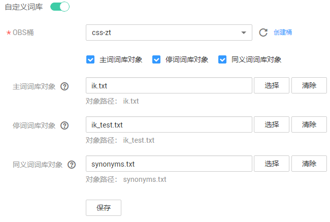

# 配置自定义词库

用户在使用搜索引擎时，针对中文，一些特殊的词语在分词的时候也能够被识别。

例如，想根据公司名称来查询，如“华为”；或者想根据网络上的某个流行词来查询，如“喜大普奔”。

针对如上场景，您可以使用云搜索服务的自定义词库功能完成分词。且支持热更新，不需要重启集群即可生效。

> **说明：** 
>自定义词库功能上线之前（即2018年3月10日之前）创建的集群，无法使用自定义词库功能。

## 基本概念

-   主词库：主词为用户希望进行分词的特殊词语，如上文场景中的“智能手机“和“喜大普奔“。主词库则是这些特殊词语的集合。主词库文件必须是UTF-8无BOM格式编码的文本文件，且文件中每一行为一个分词。主词库文件最大支持100M。
-   停词词库：停词为用户不希望进行分词或者关注的词语，如“的“、“什么“、“怎么“等。停词词库是停词词语的集合。停词词库文件必须是UTF-8无BOM格式编码的文本文件，且文件中每一行为一个分词。停词词库文件最大支持20M。
-   同义词词库：同义词为意义相同的一组词语，如“开心“和“高兴“。同义词词库是同义词词语的集合。同义词词库文件必须是UTF-8无BOM格式编码的文本文件，且文件中每一行为一组同义词，同义词之间用英文逗号隔开。同义词词库文件最大支持20MB。

## 前提条件

登录云搜索服务管理控制台的账号或IAM用户必须同时具备如下两个权限才能使用自定义词库功能。

-   “全局服务“中“对象存储服务“项目的“OBS Administrator“权限。
-   当前所属区域的“Elasticsearch Administrator“权限。

## 配置自定义词库

1.  在云搜索服务[管理控制台](https://console.huaweicloud.com/elasticsearch/?locale=zh-cn)，单击左侧导航栏的“集群管理“。
2.  在“集群管理“页面，单击需要配置自定义词库的集群名称，进入集群信息页面。
3.  在集群信息页面，单击“自定义词库“页签。

    **图 1**  选择自定义词库页签  
    

4.  在“自定义词库“页面，您可以单击开关来开启或关闭自定义词库功能。

    -   OBS桶：主词库、停词词库和同义词词库文件存储的OBS桶位置。如果当前没有可用OBS桶，您可以单击“创建桶“进行创建，详细操作步骤请参见[创建桶](https://support.huaweicloud.com/usermanual-obs/zh-cn_topic_0045829088.html)。创建的OBS桶必须和集群所在“区域“相同。
    -   主词库对象：主词库的文件，当前只支持编码为UTF-8无BOM格式编码的文本文件。必须先把文件存储到对应OBS路径下。
    -   停词词库对象：停词词库的文件，当前只支持UTF-8无BOM格式编码的文本文件。必须先把文件存储到对应OBS路径下。
    -   同义词词库对象：同义词词库的文件，当前只支持UTF-8无BOM格式编码的文本文件。必须先把文件存储到对应OBS路径下。

        > **说明：** 
        >云搜索服务支持单独更新主词库对象、停词词库对象或者同义词词库对象信息。

    **图 2**  配置自定义词库  
    

5.  单击“保存“，在“确认“对话框中，单击“确定“。词库信息在下方呈现，此时词库状态为“更新中“。请耐心等待1分钟左右，当词库配置完成后，词库状态变更为“成功“，此时，配置的词库信息已在此集群中生效。

    **图 3**  词库信息  
    

## 修改自定义词库

云搜索服务支持单独修改其中某个自定义词库文件，如果您需要修改已配置的自定义词库的参数，您可以修改自定义词库。请提前将词库文件上传至对应的OBS桶中。在“自定义词库“页面，直接修改“OBS桶“、“主词库对象“、“停词词库对象“或“同义词词库对象“参数，单击“保存“。在弹出的提示框中单击“确定“。当词库修改完成后，词库状态变更为“成功“。

**图 4**  修改后的词库信息  

## 删除自定义词库

如果您的词库已不再需要，您可以删除词库释放资源。

在自定义词库页面，单击按钮，在弹出的提示框中单击“确定“。词库信息删除后，自定义词库界面如下所示。

**图 5**  删除自定义词库后的界面  

